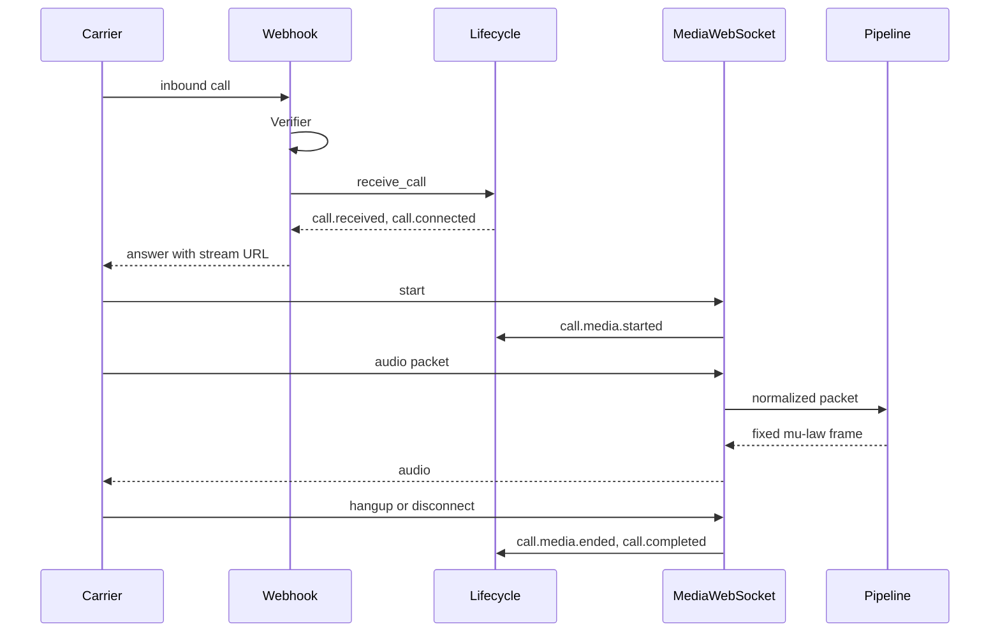

# Architecture

> **DRAFT (BELL bootstrap).** ATLAS owns this document and should refine it. This version exists so the first telephony vertical slice has an explicit shape.

Switchboard’s first slice is one Python process. It answers inbound calls on operator-controlled numbers, normalizes them into a `CallSession`, accepts a media WebSocket, observes inbound audio, returns a fixed tone, and records hangup.

There is no dashboard, speech pipeline, or campaign store in this slice.

## Modules

| Module | Role |
| --- | --- |
| `switchboard.api` | FastAPI routes. No vendor signature math and no vendor frame layout. |
| `switchboard.security` | `WebhookVerifier` boundary. Mock HMAC and Twilio HMAC-SHA1. |
| `switchboard.providers` | `TelephonyProvider` port, `MockTelephonyProvider`, `TwilioTelephonyProvider`. |
| `switchboard.lifecycle` | State machine, in-memory store, domain events. |
| `switchboard.media` | Framers, WebSocket gateway, `MediaPipeline` (fixed tone until ECHO). |
| `switchboard.simulator` | CLI that places a signed mock call against a running server. |

## Provider boundary

Routes and `CallLifecycle` depend on `TelephonyProvider`, `WebhookVerifier`, and `MediaFramer`. They do not import a vendor SDK. Adding a carrier means a new provider, verifier, and framer registered in `build_container`.

`receive_call` normalizes an answer webhook. `build_answer` is vendor-specific (JSON for mock, TwiML for Twilio) and is the only place that chooses how the carrier opens the stream. `open_media_stream` registers a stream the carrier opened to us. `forward_call` and `terminate_call` are the vendor side effects. `get_call_status` mirrors local state in this slice.

## What is intentionally absent

- Vue / RADAR dashboard
- ECHO speech-to-text and text-to-speech (the pipeline port is the handoff)
- Postgres and Redis (ADR-001)
- Campaign correlation and intelligence extraction
- Authentication on the local control API and media socket (SENTINEL follow-up; webhooks are verified)
