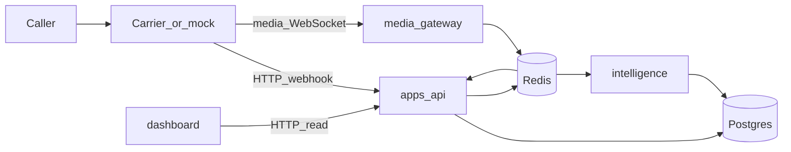
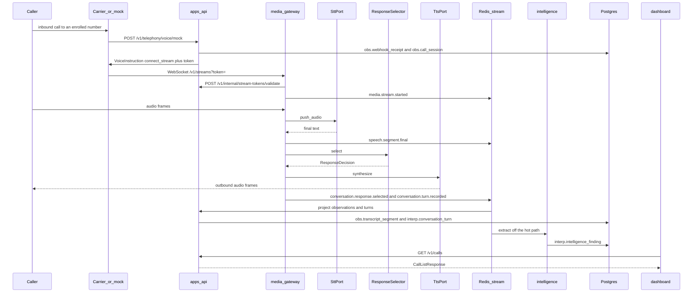
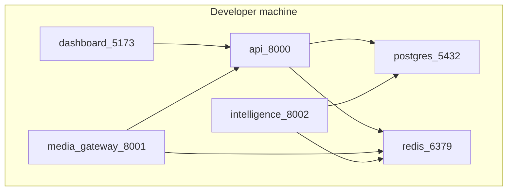
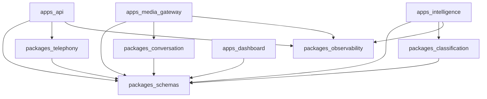

# Architecture

Contract version: **0.1.0**. Machine-readable fields live in `packages/schemas`. This document is the structural authority for how those fields move through the system. A change to either one updates both in the same pull request.

Project Switchboard is an operator-controlled scam-call honeypot. It records what the caller did, derives claims from that record, and only then suggests campaign links. Those three layers stay separate end to end.

## System diagram

The caller only ever reaches a carrier number the operator enrolled. The dashboard only ever reads the API. The media gateway is the only process that sees audio frames.

## Major components

| Piece | Role in the MVP slice |
| --- | --- |
| `apps/api` | Carrier webhooks, call-session lifecycle, read API, event projection into Postgres |
| `apps/media_gateway` | Switchboard Media Protocol WebSocket, STT port, response-selector port, TTS port |
| `apps/intelligence` | Async finding extraction (SHERLOCK) and campaign correlation (WATSON) |
| `apps/dashboard` | Vue operator view. Polls the read API |
| `packages/schemas` | Pydantic contracts and the TypeScript mirror |
| `packages/telephony` | Carrier signature and instruction ports (BELL) |
| `packages/conversation` | Hot-path response selector (LOKI) |
| `packages/classification` | Extractor and correlator ports |
| `packages/observability` | Log helper and redaction denylist |
| Postgres | System of record, split into `ops`, `obs`, `interp`, `attr` |
| Redis | Stream tokens and the durable event stream. Not a system of record |

Specialist behavior behind those ports is stubbed. See `docs/STATUS.md` for what the running skeleton actually does.

## MVP data and control flow

Target slice: a test call hits the webhook, a session is stored, audio is streamed, speech is recognized, a simple reply is selected and synthesized, the transcript is stored, a basic finding is proposed, and the call shows up in the dashboard.

Two clocks exist:

- **Hot path.** Audio, recognition, reply selection, and synthesis stay inside `media_gateway`. They call in-process ports. They do not wait for Postgres, intelligence, or the dashboard.
- **Durable path.** The gateway and the API publish `EventEnvelope` records to Redis stream `switchboard.events`. Consumers project rows and propose findings. A failure there leaves the live call up.

Media frames are not events. A frame is consumed inside the gateway and discarded after the ports return. The MVP stores transcripts, not audio.

## Session state

`obs.call_session.state` moves in one direction:

1. `telephony.call.received` creates the row in `ringing`.
2. `media.stream.started` sets `in_progress` and is accompanied by `telephony.call.answered`.
3. A carrier status callback or a stream failure sets `completed` or `failed`.

Caller ID is copied onto the session as an observation. It is not an identity check.

The mock provider derives `call_session_id` as UUIDv5 of `SWITCHBOARD_ID_NAMESPACE` and `mock:{provider_call_id}`. Retries of the same provider call resolve to the same id.

## Local Docker topology

`docker-compose.yml` starts Postgres 16, Redis 7, and the four apps. Init SQL in `apps/api/migrations` loads on first Postgres start and enrolls dev number `+15550001001`.

| Service | Host port | Listens for |
| --- | --- | --- |
| `postgres` | 5432 | SQL from `api` and `intelligence` |
| `redis` | 6379 | tokens and `switchboard.events` |
| `api` | 8000 | carrier webhooks, dashboard, internal token checks |
| `media_gateway` | 8001 | media WebSocket |
| `intelligence` | 8002 | internal extract, later bus consumers |
| `dashboard` | 5173 | operator browser |

The browser talks to `http://localhost:8000`. Containers talk to each other by service name. Compose sets `SWITCHBOARD_DEV_WEBHOOK_BYPASS=1` only on the API container so a local curl works. That flag is ignored unless `SWITCHBOARD_ENV=dev`. See `docs/SECURITY.md`.

`DATABASE_URL` and `REDIS_URL` are present in the process environment. The voice webhook writes `obs.webhook_receipt` and `obs.call_session` and best-effort publishes `telephony.call.received`. Shared repository coverage (`SB-017`) and the consumer-group helper (`SB-016`) are still open. The media gateway, intelligence, and dashboard do not open those clients.

## Package import direction

Apps depend on packages. Packages do not depend on apps. `packages/observability` is a leaf. `packages/telephony` depends only on `packages/schemas` so it can render `VoiceInstruction`. `packages/conversation` and `packages/classification` depend only on `packages/schemas`.

## Failure isolation

| If this fails | The live call |
| --- | --- |
| Dashboard or intelligence | Continues. Findings catch up later |
| Response selector exception | Gateway plays no audio for that turn and stays on the socket |
| Postgres | New webhooks fail. An already-open socket keeps running |
| Redis | New tokens and new events fail. An already-open socket keeps running until it needs a new publish |
| STT or TTS mock | That turn produces no audio. The socket stays up |

Intelligence never writes `obs.*`. The media gateway never writes Postgres. The dashboard never writes anything.
