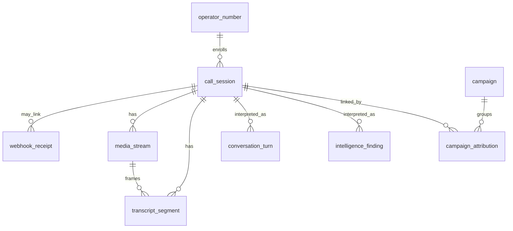

# Data model

Contract version **0.1.0**. Postgres is the system of record. Schemas `obs`, `interp`, and `attr` are the storage form of the three record layers. Pydantic models repeat `record_layer` on the wire so a JSON client can see the layer without guessing from the URL.

SQL: `apps/api/migrations/001_init.sql`. Dev enrollment: `002_seed_dev.sql` (`+15550001001`, id `00000000-0000-4000-8000-000000000001`).

## Layers

| Layer | Postgres schema | Question it answers | Who may treat it as fact |
| --- | --- | --- | --- |
| Observation | `obs` | What arrived from the carrier, the socket, or the recognizer | Downstream jobs, as a record of the input |
| Interpretation | `interp` | What a Switchboard method derived, with a confidence and a method id | Operators, as a proposal until status says otherwise |
| Attribution | `attr` | Which campaign a call is being linked to, and why | Operators, as a hypothesis until status is `corroborated` |

An observation does not contain a campaign id, a finding id, or a strategy confidence. An interpretation cites observation ids. An attribution cites finding ids and one call session. The chain is attribution → finding → transcript segment → call session.

`CallSessionSummary` is a read model for list rows. It is not stored as its own table.

`ops.operator_number` is configuration, not a call observation.

## Entities

### OperatorNumber (`ops.operator_number`)

| Field | Notes |
| --- | --- |
| `id` | UUID |
| `e164` | Enrolled honeypot number |
| `label` | Operator nickname |
| `status` | `active` or `retired` |
| `created_at` | Aware timestamp |

### CallSession (`obs.call_session`) — observation

| Field | Notes |
| --- | --- |
| `id` | UUID. Mock provider uses UUIDv5 as documented in the API contract |
| `operator_number_id` | Nullable FK to `ops.operator_number` |
| `external_call_id` | Carrier id. Unique with `carrier` |
| `carrier` | `mock` in 0.1.0 |
| `caller_number_e164` | Observed signaling. Untrusted |
| `called_number_e164` | Dialed honeypot number as observed |
| `state` | `ringing`, `in_progress`, `completed`, `failed` |
| `started_at`, `answered_at`, `ended_at` | Aware timestamps. Answered and ended are null until those transitions |
| `end_reason` | Nullable text |

Mutable columns: `state`, `answered_at`, `ended_at`, `end_reason`, `updated_at`, and `operator_number_id` if it was null at insert. Caller and called numbers are immutable.

### WebhookReceipt (`obs.webhook_receipt`) — observation

Append-only. `payload` is the raw JSON object. `signature_valid` is true, false, or null when the check did not run. `call_session_id` is null when the webhook was stored but no session was opened (unknown number, bad signature).

### MediaStream (`obs.media_stream`) — observation

`protocol` is `switchboard.media.v1`. `encoding` is `audio/pcmu` or `audio/pcm`. `state` is `connecting`, `streaming`, `closed`, or `failed`. Unique on (`call_session_id`, `external_stream_id`). Mutable: `state`, `ended_at`.

### TranscriptSegment (`obs.transcript_segment`) — observation

| Field | Notes |
| --- | --- |
| `sequence` | Unique per call, starting at 0 |
| `speaker` | `caller` or `honeypot` |
| `source` | `stt` or `tts_input` |
| `text` | What the recognizer returned, or the text sent to TTS. Immutable |
| `start_offset_ms`, `end_offset_ms` | Media timeline, not wall clock |
| `is_final` | Stored rows are finals |
| `stt_confidence` | Nullable provider score in `[0, 1]`. Null for `tts_input` |
| `provider` | `mock-stt` or a later recognizer id |

There is no Switchboard confidence column on this table.

### ConversationTurn (`interp.conversation_turn`) — interpretation

One row per turn index per call. `transcript_segment_ids` cites the observations the turn was built from. `strategy_id` is null on caller turns. `confidence` is required and is the selector's certainty about its own decision, or `1.0` for a caller turn that is only a grouping of finals.

### IntelligenceFinding (`interp.intelligence_finding`) — interpretation

| Field | Notes |
| --- | --- |
| `kind` | `callback_number`, `pretext`, `organization_name`, `payment_method`, `url`, `person_name`, `other` |
| `value` | Normalized claim |
| `raw_quote` | Span copied from a transcript |
| `transcript_segment_ids` | At least one id |
| `extractor`, `extractor_version` | Method identity |
| `confidence` | Required, `[0, 1]`, independent of `stt_confidence` |
| `status` | `proposed`, `accepted`, or `rejected` |

New rows start as `proposed`. Acceptance is an operator or policy action. It does not rewrite the quote or the segment ids.

### Campaign (`attr.campaign`) — attribution

`status` is `hypothesized`, `corroborated`, or `closed`. A label is a name for the cluster, not a finding of fact. `summary` is nullable prose.

### CampaignAttribution (`attr.campaign_attribution`) — attribution

Links one campaign to one call. `supporting_finding_ids` has at least one id. `method` and `method_version` name the correlator. `confidence` and `rationale` are required. Corroborating a campaign is a status change on `attr.campaign`, not a confidence of `1.0` written back onto findings.

## Relationships

Foreign keys point from `interp` and `attr` toward `obs`, and from `obs.call_session` toward `ops.operator_number`. There is no foreign key from `obs` to `interp` or `attr`.

## Writers

| Table | Writer |
| --- | --- |
| `ops.operator_number` | Operators via a later admin path. Seed SQL for local dev |
| `obs.*` and `interp.conversation_turn` | `apps/api` projector |
| `interp.intelligence_finding` | `apps/intelligence` extractor |
| `attr.campaign` and `attr.campaign_attribution` | `apps/intelligence` correlator |

The media gateway and the dashboard have no database credentials in the target deployment. The gateway publishes through `packages/events` and does not import `packages/repositories`.

Python writes go through `packages/repositories`:

| Port | Who calls it | Tables |
| --- | --- | --- |
| `TelephonyObsStore` | API voice webhook | active `ops.operator_number` lookup, idempotent `obs.call_session` insert, append-only `obs.webhook_receipt` |
| `observation_writer` | API projector | `ops` read, `obs.*`, `interp.conversation_turn` |
| `finding_writer` | intelligence extractor | `interp.intelligence_finding` |
| `attribution_writer` | intelligence correlator | `attr.campaign`, `attr.campaign_attribution` |
| `read_models` | API read routes (`SB-018`) | fetch helpers for every table above |

`insert_ringing` is idempotent on `(carrier, external_call_id)` and does not change the stored caller number. New findings are inserted as `proposed` and have no campaign column. `set_status` on a finding updates `status` only.

## Redis keys

| Key | Contents | Durability |
| --- | --- | --- |
| `switchboard.events` | Event envelopes. One field, `envelope`, JSON text | Recoverable only while Redis has the stream. Postgres is the record |
| `switchboard.events:id:{event_id}` | Stream id already published for that `event_id` | Same lifetime as Redis. Makes publish idempotent |
| `switchboard.events:ack:{group}:{event_id}` | Stream id acknowledged by that consumer group | Same lifetime as Redis. A redelivery is not handled twice |
| `stream_token:{token}` | `call_session_id` and expiry | Ephemeral. Target TTL 60s, single use |

Tokens are not rows in Postgres in 0.1.0.
