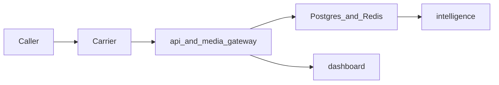

# Security baseline

Contract version **0.1.0**. ATLAS owns this baseline. SENTINEL deepens it (`SB-014`, `SB-015`) and can replace controls that are still mocks. This document is the bar those changes have to clear.

The caller is untrusted. Caller ID, transcript text, and extracted values are hostile input. The operator is the only principal who should see records.

## Trust boundaries

| Boundary | Enters | Stops here |
| --- | --- | --- |
| Carrier webhook | Provider HTTP body | Signature check, then Switchboard models |
| Media socket | Audio and media JSON | Token check, then ports inside the gateway |
| Internal HTTP | Token issue, token validate, extract | `X-Switchboard-Internal-Token` |
| Dashboard | Browser on the operator network | Read API only |

Postgres and Redis are not exposed to the caller. In the local compose file their ports are published on localhost for development. A shared deployment does not publish them.

## Requirements

- Only enrolled operator numbers accept a session. Unknown `to_e164` is `403 number_not_enrolled` and does not receive a stream token. The response does not list enrolled numbers.
- Webhook signatures are verified on the raw body, before JSON schema validation. The mock header `X-Switchboard-Mock-Signature: dev` is a local stand-in. It is not a production authenticator. A body HMAC is not accepted in its place.
- `SWITCHBOARD_DEV_WEBHOOK_BYPASS=1` is honored only when `SWITCHBOARD_ENV=dev`. Any other environment ignores the flag and uses the verifier. The compose file turns the flag on for local curl. Production configuration leaves it unset.
- Stream tokens last 60 seconds, are bound to one `call_session_id`, and are single-use in the target store. The skeleton store is process memory and is not single-use. `SB-014` replaces it before any non-local deployment.
- The media gateway accepts a socket only after the API reports `valid: true`. The skeleton checks only that the query string is non-empty. That is a known gap.
- Internal routes require the internal token. Comparison uses `hmac.compare_digest` on UTF-8 bytes.
- The platform places no outbound calls. It does not fetch URLs that appear in transcripts. It does not execute caller instructions.
- Audio frames are not written to Redis, Postgres, or logs in the MVP.
- Logs pass through `safe_fields`. Dropped keys include `audio`, `authorization`, `payload`, `payload_b64`, `raw_body`, `stream_token`, and `token`.
- Validation errors return `invalid_request` and do not echo the submitted body.
- Dashboard access is operator-only before any deployment beyond localhost. The skeleton has no login. Do not publish port 5173 or 8000 to an untrusted network as if that were access control.
- Secrets come from the environment. The repository holds `.env.example` with local values only. The local Postgres password `switchboard` is a development default, not a production secret.
- Caller numbers are confidential. They may be spoofed victim numbers. They are not demo data for screenshots outside the operator team.
- Findings stay `proposed` until an explicit accept or reject. Acceptance is not inferred from confidence.

## Data classes

| Data | Class | MVP handling |
| --- | --- | --- |
| Operator numbers | Configuration | `ops.operator_number` |
| Caller number, called number | Sensitive observation | Stored on the session. Redact in logs |
| Raw webhook JSON | Sensitive observation | `obs.webhook_receipt.payload` only |
| Audio | Sensitive media | Not retained |
| Transcript text | Sensitive observation | `obs.transcript_segment` |
| Findings and attributions | Sensitive interpretation | Separate tables, confidence required |
| Stream tokens and internal token | Secret | Memory or Redis. Never logged |

## Retention

The MVP keeps webhook receipts, sessions, media-stream metadata, transcript segments, turns, findings, and attributions. It does not keep audio. Deletion and legal hold are CLERK and SENTINEL follow-ons. Until those exist, local Docker volumes are wiped by removing the `switchboard_pg` volume.

## Hostile-content handling

Transcript text is stored and displayed as text. It is not rendered as HTML that the caller controls. The dashboard stub inserts text through Vue's default escaping. Extractors treat the text as data. A finding of kind `url` or `callback_number` is a string with a citation, not a request to dial or browse.

## Local defaults that must not ship

| Setting | Local compose | Required outside local dev |
| --- | --- | --- |
| `SWITCHBOARD_ENV` | `dev` | A non-dev name |
| `SWITCHBOARD_DEV_WEBHOOK_BYPASS` | `1` | Unset |
| `SWITCHBOARD_INTERNAL_TOKEN` | `dev-internal-token` | A random secret |
| Postgres password | `switchboard` | A real secret, not in git |
| Redis | No AUTH | AUTH and network policy |
| Mock signature | `dev` | Provider verifier, fail closed |

## Known skeleton gaps

SENTINEL owns closing these. They are recorded so nobody treats the stub as the control.

| Gap | This pass |
| --- | --- |
| Signature is checked after FastAPI has parsed the JSON body. | **Closed** for `POST /v1/telephony/voice/{provider}` and `POST /v1/telephony/status/{provider}`. An unsigned or invalid signature returns `401 webhook_unauthorized` before a schema error. The app still reads the body through the framework; a reverse proxy has to enforce the same cap first. |
| Stream tokens are process-local, reusable, and not stored in Redis. | **Open.** `SB-014`. The in-memory store still returns `valid: true` on a second validate. |
| The media socket does not call the validate route. | **Open** for authentication (`SB-004`). **Closed** for byte accounting: each received frame is passed to `admit_frame` and a deny closes the socket with `1008`. That is not a token check. |
| The read API and the dashboard have no operator authentication. | **Open.** |
| Internal token comparison is constant-time, and the rest of the auth story is not built. | **Open.** Comparison was already constant-time. Operator sessions are not. |
| There is no rate limit on the webhook. | **Closed** in-process. Voice and status share a per-client-host window, default 600 events per minute, plus a 1 MiB body cap (`413` / `429`). The limiter is not shared across API processes. |
| `Health` does not check dependencies, so a load balancer that only hits `/health` will not notice a down database. | **Partially closed.** `SWITCHBOARD_HEALTH_PROBES=1` makes `GET /health` return `503 dependencies_unavailable` when Postgres or Redis refuses TCP. The flag is off in compose, because the apps still do not open those clients (`SB-017`). A load balancer on the default compose file still only sees process liveness. |

## Logging

Use `switchboard_observability.log_info`. New keys that carry secrets are added to `REDACTED_KEYS` in the same change. Startup logs may say that a database URL is configured. They do not print the URL.

## Threat model

Each section states the asset, the attacker, the required control, and what this pass actually closed. Open items point at the gap table above.

### Telephone ingress

| | |
| --- | --- |
| Asset | Enrolled operator numbers, and the decision to open a session |
| Attacker | Anyone who can deliver a webhook to the API, including a caller who spoofs caller ID |
| Required control | Accept a session only for an enrolled `to_e164`. Unknown numbers are `403 number_not_enrolled`, get no stream token, and the response does not list enrolled numbers. Caller ID is an observation, not an identity. The platform never places a call. |

**This pass.** Enrollment persistence is still **open** (`SB-001`). The voice route still issues a token for any signed mock body. The control that landed here is admission of that body: size, rate, then signature, then schema.

### Provider webhooks

| | |
| --- | --- |
| Asset | The right to create a session and receive a stream token |
| Attacker | A client who posts forged, replayed, oversized, or high-rate HTTP to `/v1/telephony/voice/{provider}` or `/v1/telephony/status/{provider}` |
| Required control | Authenticate the raw bytes before trusting JSON. Fail closed outside dev. Cap body size. Rate-limit the edge. Do not echo the body in errors or logs. |

**This pass.** **Closed** for the mock provider on both routes. Order is: read the raw body, reject over 1 MiB (`413 webhook_too_large`), apply the per-client-host window (`429 webhook_rate_limited`, default 600 events per minute), then `MockSignatureVerifier` or the dev bypass, then `model_validate_json`. Unsigned garbage is `401 webhook_unauthorized`. Signed garbage is `422 invalid_request`.

The mock header is `X-Switchboard-Mock-Signature: dev`. It does not cover the body. A body HMAC is not a substitute. `SWITCHBOARD_DEV_WEBHOOK_BYPASS=1` still works only when `SWITCHBOARD_ENV=dev`.

Residuals, left **open**:

- The limiter is process-local. A second API process has its own window.
- FastAPI has already buffered the body. A reverse proxy has to enforce the same cap first.
- FastAPI validates `{provider}` before the handler. An unknown provider is `422` even when the body is unsigned. The mock path still checks the signature before JSON.
- The mock credential is static, so the same header verifies twice. Replay dedupe belongs on `provider_call_id` (`SB-001`), not on this header.
- A production verifier is a new class beside `MockSignatureVerifier` in `packages/telephony`. There is no second signature package.

### WebSockets

| | |
| --- | --- |
| Asset | The media socket, and the audio it is allowed to accept |
| Attacker | A client who opens `/v1/streams` with a stolen, guessed, or replayed token, or who sends oversized frames |
| Required control | Accept the socket only after the API reports `valid: true` for that token and session. Close `1008` on a missing or invalid token. Cap each message. |

**This pass.** Token validation is **open** (`SB-004`). The socket still accepts any non-empty query string. Byte accounting is **closed**: each received frame goes through `admit_frame`, and a deny closes the socket with `1008` and logs `media_budget_denied` with the reason only.

### Audio streams

| | |
| --- | --- |
| Asset | Process memory, and the guarantee that caller audio is not retained |
| Attacker | A caller or a socket client who floods frames, holds a call open, or marks frames late to dodge a cap |
| Required control | Bound concurrent calls, call duration, bytes per call, bytes per second, and per-message size. Count late frames toward the budget. Do not write audio to Redis, Postgres, or logs. |

**This pass.** The per-socket byte budget and the websocket message cap are **closed** on the media gateway. Defaults live on `sentinel.limits.ResourceLimits`: 50 concurrent calls, 1800 seconds, 25 MiB per call, 64 KiB per second, 64 KiB per websocket message. The socket does not yet run the duration timer or the jitter classifier. Those helpers exist and are tested, and they are **open** on the hot path until ECHO has frame timestamps (`SB-004`, `SB-008`).

### LLM boundaries

| | |
| --- | --- |
| Asset | The operator's actions, and the separation between observation and interpretation |
| Attacker | A caller whose speech is transcribed into instructions, or a model that returns tool calls, HTML, or extra fields |
| Required control | Transcript text and model output are data. They are not instructions, HTML, or a reason to dial or browse. Prompts are length-capped. Findings stay `proposed` until an operator accepts or rejects them. A model outage does not close the media socket. |

**This pass.** No model client exists. `POST /v1/internal/extract` still returns an empty list. The prompt and transcript length helpers are tested and are **open** on the extractor until SHERLOCK calls them (`SB-009`). The adversarial corpora under `sentinel.fixtures` are labeled samples for those tests. They are not a parser.

### Database

| | |
| --- | --- |
| Asset | `ops`, `obs`, `interp`, and `attr` rows, including caller numbers and webhook receipts |
| Attacker | Anyone who can reach Postgres, or a writer who stores caller-controlled text in a column the dashboard renders as HTML |
| Required control | The database is not reachable by the caller. Queries are parameterized. Observation, interpretation, and attribution stay in their own schemas. Caller-controlled strings are stored as text. Secrets are not columns on the session. |

**This pass.** **Open.** Apps do not open a database client (`SB-017`). Local compose publishes Postgres on localhost with the development password `switchboard`. That password does not ship.

### Dashboard

| | |
| --- | --- |
| Asset | Call records, transcripts, and findings |
| Attacker | Anyone who can open the operator UI or call the read API |
| Required control | Operator authentication before any deployment beyond localhost. Transcript and finding text render as text. The UI does not dial numbers or open URLs from findings. |

**This pass.** **Open.** The read API and the Vue stub have no login. Do not publish port 5173 or 8000 as if that were access control.

### Authentication

| | |
| --- | --- |
| Asset | Stream tokens, the internal token, and the webhook credential |
| Attacker | A reader of logs, a replayer of tokens, or a client who sets the dev bypass outside dev |
| Required control | Stream tokens last 60 seconds, bind to one `call_session_id`, and are single-use. Internal routes compare `X-Switchboard-Internal-Token` with `hmac.compare_digest`. The dev webhook bypass is ignored unless `SWITCHBOARD_ENV=dev`. Tokens and signature values are not logged. |

**This pass.** Bypass fail-closed behavior was already in the skeleton and remains. Internal comparison was already constant-time. Stream tokens are **open** (`SB-014`): the store is process memory, the TTL is 60 seconds, and a second validate still returns `valid: true`.

### External APIs

| | |
| --- | --- |
| Asset | Carrier, STT, TTS, and model credentials, and the network path to those providers |
| Attacker | A caller who plants a URL or a callback number, or a compromised dependency that phones home with a secret |
| Required control | The platform does not fetch URLs from transcripts and does not place calls. Provider credentials stay in the environment. Outbound calls to a provider use that provider's client, with timeouts, and a failure becomes a degraded mode in the matrix below rather than a retry storm. |

**This pass.** **Closed** as a non-behavior: no outbound client exists. The corpora in `sentinel.fixtures` include URL-shaped strings so later adapters can prove they do not fetch them.

### Report generation

| | |
| --- | --- |
| Asset | An evidence manifest an operator might share |
| Attacker | A caller who wants their text copied into an observation slot, or a report that includes tokens, raw audio, or the internal credential |
| Required control | A manifest references ids in observation, finding, and attribution sections and hashes its canonical JSON. It does not copy finding text into an observation slot, and it does not embed secrets or audio. |

**This pass.** **Open** (`SB-019`). No report writer exists. The layer split in `docs/DATA_MODEL.md` is the constraint that writer has to keep.

## Failure-mode matrix

The skeleton's mocks do not implement these modes yet. The matrix is the behavior adapters have to hit. A down intelligence process must not drop the media socket (milestone exit bar).

| Failure | Caller-facing behavior | What stays durable | What this pass does |
| --- | --- | --- | --- |
| Provider webhook outage or reject | No session is created for an unsigned, oversized, or rate-limited body. A signed body the provider later says is duplicate resolves to the same `provider_call_id` session once `SB-001` exists. | The raw receipt, once persistence exists. Not a token. | **Closed** for signature, size, and in-process rate limit. Persistence is open. |
| STT outage or empty recognition | The socket stays up. The selector may return a low-confidence reply. No fabricated transcript is stored. | Media-stream metadata only. Audio is not retained. | **Open** for a live recognizer. The socket calls `MockStt`. The fixture frame publishes one `speech.segment.final` and then runs the selector. Any other frame publishes nothing and does not select. A failed publish does not close the socket. |
| TTS outage or empty audio | The caller hears silence for that turn. The socket stays up. The turn can still be recorded as an empty synthesis. | The selected response text, once the socket calls the selector. | **Open** for a live synthesizer. The socket calls `MockTts` after a final. Non-empty audio is sent as `media`. Empty audio sends nothing. The turn events are still published. A failed publish does not close the socket. |
| LLM or extractor outage | Findings are omitted. The call and the transcript observation still complete. | Observations. Interpretations stay absent rather than guessed. | **Open.** Extract returns `[]`. Exceptions must not close sockets when `SB-010` lands. |
| Database outage | With probes enabled, `GET /health` is `503 dependencies_unavailable`. Write paths refuse the new session instead of acknowledging a row they did not store. | Nothing new. Existing volumes are unchanged. | **Partial.** TCP probes only, and only when `SWITCHBOARD_HEALTH_PROBES=1`. No repository writes (`SB-017`). |
| Redis outage | Same health probe. Token issue fails closed once tokens live in Redis. In-process fallback is not a production mode. | No new token. | **Partial** for the probe. **Open** for `SB-014`: today's tokens are process memory and ignore Redis. |
| Network jitter | Late frames are counted and not played back as live audio. Invalid delays do not grant extra budget. | Byte accounting only. | Helper `evaluate_audio_frame` is tested. The socket does **not** classify jitter yet. |
| Caller disconnect | The socket loop exits on `WebSocketDisconnect` and logs `media_socket_closed` only after a clean stop. A budget deny logs `media_budget_denied` and closes `1008`. | No audio. Session end waits on the status callback (`SB-003`). | **Closed** for the socket loop's existing disconnect path. |
| Caller reconnect | A new socket requires a new single-use token. The old token does not reopen the stream. | The same `call_session_id` when the provider call id matches. | **Open** until `SB-014` and `SB-004`. |

`status: ok` from `GET /health` means the process is up. It does not mean Postgres or Redis accepted a connection unless the probe flag is set. Compose leaves the flag unset.

## Security checklist

Implementers check these before treating a ticket as done:

1. Webhook routes read the raw body and run size, rate, and `SignatureVerifier.verify` before `model_validate_json`.
2. New provider verifiers implement `SignatureVerifier` in `packages/telephony`. They do not add a parallel signature package.
3. `SWITCHBOARD_DEV_WEBHOOK_BYPASS` is read only through settings, and tests cover a non-dev environment ignoring the flag.
4. Error bodies use the stable `error` code. They do not include the request body, the signature header, or a token.
5. Log calls go through `log_info`. New secret-shaped fields are added to `REDACTED_KEYS` in the same change.
6. Stream tokens are single-use, expire in 60 seconds, and are absent from logs (`SB-014`).
7. The media socket calls token validate before `ready`, and closes `1008` otherwise (`SB-004`).
8. Audio bytes pass `admit_frame` (or the same `CallBudget` rules) before they are buffered. Rejected audio is not counted toward the total.
9. Transcript and prompt length checks run before any model call. Model output is stored as data, with a citation, in `interp`.
10. No code path fetches a URL or dials a number taken from a transcript, a finding, or a model response.
11. Read APIs and the dashboard require an operator session before a non-local deploy.
12. Health probes stay opt-in until the apps open real Postgres and Redis clients. A probe failure is `503`, not a stack trace.
13. Tests that change env flags call `get_settings.cache_clear()` and restore the previous values.

## Recommended observability alerts

Nothing in the skeleton pages an operator. These are the alerts to attach once logs and metrics exist. Alert on the event name and the reason code. Do not put signature values, tokens, raw bodies, or audio in the alert payload.

| Signal | Condition | Why |
| --- | --- | --- |
| `webhook_rejected` with `webhook_unauthorized` | Burst above the normal carrier rate for one host | Forgery or a verifier mismatch |
| `webhook_rejected` with `webhook_rate_limited` | Sustained `429` from one client host | Flood against the in-process window. A multi-process deploy needs a shared limiter before this alert is meaningful |
| `webhook_rejected` with `webhook_too_large` | Any `413` | Oversized carrier body, or a proxy that failed to cap first |
| `media_budget_denied` | Any deny, grouped by `reason` | Audio flood, oversized frame, or a cap set tighter than the carrier's frame size |
| `media_socket_rejected` with `missing_token` | Spike of `1008` closes | Token scraping or a broken carrier stream URL |
| `dependencies_unavailable` | `GET /health` is `503` while probes are on | Postgres or Redis refused TCP |
| Token validate `valid: false` | Spike after `SB-014` | Reuse, expiry, or a leaked token |
| Extractor or model errors | Non-zero error rate while media sockets stay open | The milestone bar: intelligence may fail; the call may not drop |
| Log field audit | A log line contains a value equal to a live token or the internal token | Redaction regression |

Startup may log that a database URL is configured. It must not log the URL. The dev bypass and the mock signature `dev` are local-only; an alert on `SWITCHBOARD_ENV != dev` combined with the bypass flag is a configuration page, not a runtime metric.
