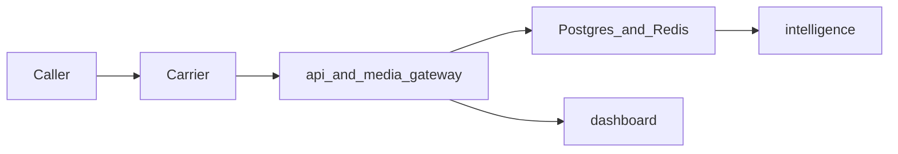

# Security baseline

Contract version **0.1.0**. ATLAS owns this baseline. SENTINEL deepens it (`SB-014`, `SB-015`) and can replace controls that are still mocks. This document is the bar those changes have to clear.

The caller is untrusted. Caller ID, transcript text, and extracted values are hostile input. The operator is the only principal who should see records.

## Trust boundaries

| Boundary | Enters | Stops here |
| --- | --- | --- |
| Carrier webhook | Provider HTTP body | Signature check, then Switchboard models |
| Media socket | Audio and media JSON | Token check, then ports inside the gateway |
| Internal HTTP | Token issue, token validate, extract | `X-Switchboard-Internal-Token` |
| Dashboard | Browser on the operator network | Read API only |

Postgres and Redis are not exposed to the caller. In the local compose file their ports are published on localhost for development. A shared deployment does not publish them.

## Requirements

- Only enrolled operator numbers accept a session. Unknown `to_e164` is `403 number_not_enrolled` and does not receive a stream token. The response does not list enrolled numbers.
- Webhook signatures are verified on the raw body. The mock header `X-Switchboard-Mock-Signature: dev` is a local stand-in. It is not a production authenticator.
- `SWITCHBOARD_DEV_WEBHOOK_BYPASS=1` is honored only when `SWITCHBOARD_ENV=dev`. Any other environment ignores the flag and uses the verifier. The compose file turns the flag on for local curl. Production configuration leaves it unset.
- Stream tokens last 60 seconds, are bound to one `call_session_id`, and are single-use in the target store. The skeleton store is process memory and is not single-use. `SB-014` replaces it before any non-local deployment.
- The media gateway accepts a socket only after the API reports `valid: true`. The skeleton checks only that the query string is non-empty. That is a known gap.
- Internal routes require the internal token. Comparison uses `hmac.compare_digest` on UTF-8 bytes.
- The platform places no outbound calls. It does not fetch URLs that appear in transcripts. It does not execute caller instructions.
- Audio frames are not written to Redis, Postgres, or logs in the MVP.
- Logs pass through `safe_fields`. Dropped keys include `audio`, `authorization`, `payload`, `payload_b64`, `raw_body`, `stream_token`, and `token`.
- Validation errors return `invalid_request` and do not echo the submitted body.
- Dashboard access is operator-only before any deployment beyond localhost. The skeleton has no login. Do not publish port 5173 or 8000 to an untrusted network as if that were access control.
- Secrets come from the environment. The repository holds `.env.example` with local values only. The local Postgres password `switchboard` is a development default, not a production secret.
- Caller numbers are confidential. They may be spoofed victim numbers. They are not demo data for screenshots outside the operator team.
- Findings stay `proposed` until an explicit accept or reject. Acceptance is not inferred from confidence.

## Data classes

| Data | Class | MVP handling |
| --- | --- | --- |
| Operator numbers | Configuration | `ops.operator_number` |
| Caller number, called number | Sensitive observation | Stored on the session. Redact in logs |
| Raw webhook JSON | Sensitive observation | `obs.webhook_receipt.payload` only |
| Audio | Sensitive media | Not retained |
| Transcript text | Sensitive observation | `obs.transcript_segment` |
| Findings and attributions | Sensitive interpretation | Separate tables, confidence required |
| Stream tokens and internal token | Secret | Memory or Redis. Never logged |

## Retention

The MVP keeps webhook receipts, sessions, media-stream metadata, transcript segments, turns, findings, and attributions. It does not keep audio. Deletion and legal hold are CLERK and SENTINEL follow-ons. Until those exist, local Docker volumes are wiped by removing the `switchboard_pg` volume.

## Hostile-content handling

Transcript text is stored and displayed as text. It is not rendered as HTML that the caller controls. The dashboard stub inserts text through Vue's default escaping. Extractors treat the text as data. A finding of kind `url` or `callback_number` is a string with a citation, not a request to dial or browse.

## Local defaults that must not ship

| Setting | Local compose | Required outside local dev |
| --- | --- | --- |
| `SWITCHBOARD_ENV` | `dev` | A non-dev name |
| `SWITCHBOARD_DEV_WEBHOOK_BYPASS` | `1` | Unset |
| `SWITCHBOARD_INTERNAL_TOKEN` | `dev-internal-token` | A random secret |
| Postgres password | `switchboard` | A real secret, not in git |
| Redis | No AUTH | AUTH and network policy |
| Mock signature | `dev` | Provider verifier, fail closed |

## Known skeleton gaps

SENTINEL owns closing these. They are recorded so nobody treats the stub as the control:

- Signature is checked after FastAPI has parsed the JSON body.
- Stream tokens are process-local, reusable, and not stored in Redis.
- The media socket does not call the validate route.
- The read API and the dashboard have no operator authentication.
- Internal token comparison is constant-time, and the rest of the auth story is not built.
- There is no rate limit on the webhook.
- `Health` does not check dependencies, so a load balancer that only hits `/health` will not notice a down database.

## Logging

Use `switchboard_observability.log_info`. New keys that carry secrets are added to `REDACTED_KEYS` in the same change. Startup logs may say that a database URL is configured. They do not print the URL.
