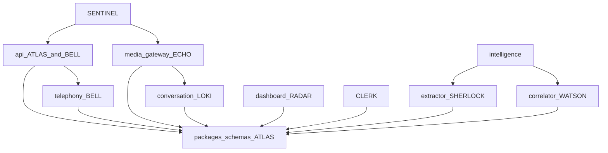

# Status

Contract version **0.1.0**. Updated by ATLAS on 2026-09-25.

The authoritative docs exist, the repository layout exists, and the shared schemas exist. The first-milestone phone call is not implemented. ECHO has landed media parsing, token checks, deterministic mock TTS, and hot-path timing (SB-004, SB-006, SB-020). The other stubs advertise the contracts and stop there.

## What runs today

| Target step | Skeleton |
| --- | --- |
| Test call reaches a webhook | `POST /v1/telephony/voice/mock` accepts a signed or dev-bypass body |
| Call session created | Enrolled `POST /v1/telephony/voice/mock` inserts `obs.call_session` (UUIDv5) and `obs.webhook_receipt` |
| Audio streamed | WebSocket checks the token with the API, parses `start` / `media` / `stop`, and counts binary frames as audio. It does not run STT |
| Speech recognized | `MockStt` returns no text |
| Response selected | `FixedResponseSelector` exists. The socket does not call it |
| TTS and audio to caller | `MockTts` returns 160 deterministic PCMU bytes. The socket does not call it |
| Transcript stored | No projector |
| Intelligence extracted | `POST /v1/internal/extract` returns an empty list |
| Call on the dashboard | Vue page calls `GET /v1/calls`, which returns an empty list |

`docker-compose.yml` describes the local topology. The API voice webhook opens Postgres and best-effort Redis. The media gateway, intelligence, and dashboard do not. Read routes still return an empty list until `SB-018`.

## Ownership map

| Path | Owner | Notes |
| --- | --- | --- |
| `docs/` | ATLAS | Source of truth for behavior and structure |
| `packages/schemas` | ATLAS | Field changes start here |
| `packages/telephony` | BELL | Carrier parsers and verifiers |
| `packages/conversation` | LOKI | Response selector |
| `packages/classification/extractor.py` | SHERLOCK | Findings |
| `packages/classification/correlator.py` | WATSON | Campaigns |
| `packages/observability` | ATLAS interface, SENTINEL redaction | Extend `REDACTED_KEYS` rather than logging beside it |
| `apps/api` read models, errors, migrations | ATLAS | |
| `apps/api` telephony routes | BELL | HTTP shapes stay aligned with `docs/API_CONTRACTS.md` |
| `apps/media_gateway` | ECHO | Calls LOKI's selector in-process |
| `apps/intelligence` extractor worker | SHERLOCK | |
| `apps/intelligence` correlator worker | WATSON | |
| `apps/dashboard` | RADAR | Read API only |
| Evidence manifest | CLERK | No app directory yet. `SB-019` adds the model |
| Auth, tokens, abuse resistance | SENTINEL | Cross-cutting. Do not fork a second webhook stack |
| `docker-compose.yml` | ATLAS | |

An agent does not take over another owner's directory to "finish" their subsystem. Cross-cutting contract edits include ATLAS (or the schema owner) in the same change.

## Dependency graph

Runtime direction for the milestone: carrier → API → media gateway → Redis → API projector and intelligence → dashboard read.

## MVP milestone

**Definition.** A test inbound call to enrolled number `+15550001001` produces, in order:

1. A carrier webhook the API accepts.
2. An `obs.call_session` row.
3. A media WebSocket carrying audio.
4. A final transcript segment from recognition.
5. A honeypot reply selected and synthesized back to the caller.
6. Stored transcript observations and conversation turns.
7. At least one proposed `IntelligenceFinding` that cites a segment.
8. A dashboard list row for that session, and a detail view that shows transcript and findings as different layers.

**Exit bar.** The eight steps above work against the mock carrier, mock STT, and mock TTS, with the dev compose file, without a live carrier account. Confidence fields are present on every interpretation and attribution. A down intelligence process does not drop the socket.

This bootstrap does not meet the exit bar. It defines the contracts the eight steps plug into.

## Engineering tickets

`Concurrent: yes` means the owner can start immediately on this tree. `Concurrent: no` means wait for the named dependencies.

| ID | Owner | Concurrent | Depends on | Work |
| --- | --- | --- | --- | --- |
| SB-001 | BELL | yes | — | Persist the mock voice webhook |
| SB-002 | BELL | yes | — | Move `VoiceInstruction` rendering into `packages/telephony` |
| SB-003 | BELL | no | SB-001, SB-016 | Status callbacks update session state and publish telephony events |
| SB-004 | ECHO | yes | — | Parse media protocol messages and validate tokens with the API |
| SB-005 | ECHO | no | SB-004, SB-016 | Mock STT emits one final segment and `speech.segment.final` |
| SB-006 | ECHO | yes | — | Mock TTS returns deterministic non-empty audio bytes |
| SB-007 | LOKI | yes | — | Selector rules for empty vs non-empty caller text, with tests |
| SB-008 | ECHO | no | SB-004, SB-005, SB-006, SB-007 | Call `respond_to_audio` from the socket and publish conversation events |
| SB-009 | SHERLOCK | yes | — | Rule extractor cites an E.164 inside a fixture transcript |
| SB-010 | SHERLOCK | no | SB-009, SB-016 | Bus consumer writes `interp.intelligence_finding` |
| SB-011 | WATSON | yes | — | Exact-match correlator on shared `callback_number` fixtures |
| SB-012 | WATSON | no | SB-010, SB-011, SB-016 | Bus consumer writes `attr.*` and campaign events |
| SB-013 | RADAR | yes | — | Dashboard list and detail bound to the read API, including empty and error states |
| SB-014 | SENTINEL | yes | — | Redis stream tokens, 60s TTL, single-use, absent from logs |
| SB-015 | SENTINEL | yes | — | Verify webhook signatures before JSON parsing; keep bypass fail-closed outside dev |
| SB-016 | ATLAS | yes | — | Redis stream publish/consume helper that calls `validate_event` |
| SB-017 | ATLAS | yes | — | Repository functions for `ops`, `obs`, `interp`, and `attr` |
| SB-018 | ATLAS | no | SB-017 | Read routes return stored rows instead of an empty list and 404 |
| SB-019 | CLERK | yes | — | Evidence manifest model with separate observation, finding, and attribution sections plus a content hash |
| SB-020 | ECHO | yes | — | Hot-path timing fields via the observability helper; a metrics failure still returns audio |

Done-when details:

- **SB-001.** `POST /v1/telephony/voice/mock` inserts `obs.webhook_receipt` and, for enrolled `to_e164`, `obs.call_session`. Unknown numbers return `403 number_not_enrolled` after the receipt insert and do not issue a token. The same `provider_call_id` returns the same session id.
- **SB-002.** The API calls a telephony renderer for `connect_stream`, `hangup`, and `reject`. Tests cover the stream-field rules already encoded on `VoiceInstruction`.
- **SB-003.** A completed status callback sets `ended_at` and publishes `telephony.call.completed`.
- **SB-004.** JSON `start`, `media`, and `stop` validate. Binary frames count as audio. A missing token closes `1008`. A present token is checked with `POST /v1/internal/stream-tokens/validate`.
- **SB-005.** A fixture frame becomes one final `SttEvent` and a published `speech.segment.final`.
- **SB-006.** `MockTts.synthesize` returns non-empty bytes for non-empty text.
- **SB-007.** Empty caller text yields confidence below `1`. Non-empty text may keep the fixed reply. No network calls.
- **SB-008.** After a final recognition, the socket runs the selector and TTS and publishes `conversation.response.selected` and `conversation.turn.recorded`.
- **SB-009.** A segment that contains an E.164 yields one `proposed` finding citing that segment. A segment without one yields nothing.
- **SB-010.** `speech.segment.final` becomes a finding row and `intelligence.finding.proposed`. Extractor exceptions do not close media sockets.
- **SB-011.** Two fixture sessions that share a callback number yield one `hypothesized` campaign and two attributions. Distinct numbers do not merge.
- **SB-012.** `intelligence.finding.proposed` creates `attr` rows and `campaign.opened` / `campaign.attribution.proposed` as appropriate.
- **SB-013.** The operator UI lists calls and shows a detail page where transcript text and findings stay visually and typedly distinct. Empty and error responses render.
- **SB-014.** The second validate of a token is `valid: false`. Expired tokens are invalid. Token values do not appear in logs.
- **SB-015.** Signature failure happens before schema errors are returned. `SWITCHBOARD_DEV_WEBHOOK_BYPASS` still does nothing unless `SWITCHBOARD_ENV=dev`.
- **SB-016.** A helper publishes a validated envelope to `switchboard.events` and a consumer group can read it.
- **SB-017.** Insert and fetch helpers exist per writer boundary. Findings still have no campaign column.
- **SB-018.** `GET /v1/calls` and `GET /v1/calls/{id}` read Postgres. Unknown ids return `call_not_found`.
- **SB-019.** A manifest model references ids in three sections and includes a hash of its canonical JSON. It does not copy finding text into an observation slot.
- **SB-020.** Durations for STT, select, and TTS can be emitted. If that emit raises, `respond_to_audio` still returns the audio bytes.

## HANDOFF — ATLAS — 2026-09-25T20:48:46Z

### Completed

- Authoritative docs: architecture, API contracts, events, data model, ADRs, security baseline, this status.
- Repository skeleton for `apps/api`, `apps/media_gateway`, `apps/intelligence`, `apps/dashboard`, and the five packages.
- Canonical Pydantic models and a TypeScript mirror for the MVP entities, envelopes, and HTTP bodies.
- Local `docker-compose.yml` for Postgres, Redis, and the four apps, plus init SQL for the three record schemas.
- Callable stubs: mock voice webhook ack, empty read models, in-memory stream tokens, media socket `ready`, null extractor.
- Contract tests for layers, confidence, event coverage, webhook auth, and the TypeScript event-name mirror.

### Files changed

- `docs/ARCHITECTURE.md`, `docs/API_CONTRACTS.md`, `docs/EVENTS.md`, `docs/DATA_MODEL.md`, `docs/DECISIONS.md`, `docs/SECURITY.md`, `docs/STATUS.md`
- `packages/schemas`, `packages/telephony`, `packages/conversation`, `packages/classification`, `packages/observability`
- `apps/api`, `apps/media_gateway`, `apps/intelligence`, `apps/dashboard`
- `docker-compose.yml`, `Makefile`, `README.md`, `.env.example`, `apps/api/migrations/`

### Interfaces added-changed

- HTTP `/v1` on the API, media WebSocket `switchboard.media.v1`, intelligence `POST /v1/internal/extract`.
- Event taxonomy in `EventType` plus `validate_event`.
- In-process ports: `SignatureVerifier`, `ResponseSelector`, `SttPort`, `TtsPort`, `FindingExtractor`, `CampaignCorrelator`.
- Postgres schemas `ops`, `obs`, `interp`, `attr`.

### Tests

- `tests/test_contracts.py`, `tests/test_api.py`, `tests/test_media_and_intelligence.py`, `tests/test_ports.py`. `make test`: 24 passed.
- `apps/dashboard` `npm run build` (`vue-tsc` and Vite) succeeded.
- Browser check against the Vite dev server: with the API up, the page shows "No calls yet" after `GET /v1/calls`. With the API stopped, the same page shows `calls_unreachable`.
- `docker compose config` was not executed in this environment. The Docker CLI is not installed. The compose file matches the topology in `docs/ARCHITECTURE.md`.

### Dependencies

- Python 3.12, Node 22, Docker Compose v2 for the full topology.
- No live carrier, STT, or TTS account. Mocks are the milestone stand-ins.
- Schema changes require a paired edit under `packages/schemas` and the matching doc.

### Blocking issues

- None that stop the tickets marked concurrent. Persistence, the event bus, real token checks on the socket, recognition, and dashboard detail data are unimplemented on purpose.
- Dev webhook bypass and the mock signature are local-only. See `docs/SECURITY.md` before any non-local run.

### Recommended next work

Start in parallel: SB-001, SB-002, SB-004, SB-006, SB-007, SB-009, SB-011, SB-013, SB-014, SB-015, SB-016, SB-017, SB-019, SB-020.

Hold: SB-003, SB-005, SB-008, SB-010, SB-012, SB-018 until their dependencies land.

ATLAS's own next implementation tickets are SB-016 and SB-017. Other agents should not wait on those unless their ticket lists them.

## HANDOFF — BELL — 2026-09-25T21:01:48Z

### Completed

- SB-001. `POST /v1/telephony/voice/mock` inserts `obs.webhook_receipt` for an accepted call, an unknown or retired `to_e164`, and a rejected signature that reaches the handler. An active enrolled number also inserts `obs.call_session` in `ringing`. Unknown and retired numbers return `403 number_not_enrolled` after that receipt commits and do not issue a token. The same `provider_call_id` returns the stored session id. A repeat webhook does not change the caller number and does not publish a second `telephony.call.received`.
- SB-002. The API calls `VoiceInstructionRenderer` for `connect_stream`, `hangup`, and `reject`. Stream-field rules stay on `VoiceInstruction`. The token is not embedded in `stream_url`. `append_stream_token` is what adds the carrier `?token=` query.

### Files changed

- `packages/telephony/switchboard_telephony/instructions.py`, `__init__.py`, `pyproject.toml`
- `apps/api/switchboard_api/routes/telephony.py`
- `apps/api/switchboard_api/obs_store.py`
- `apps/api/switchboard_api/telephony_events.py`
- `apps/api/switchboard_api/memory_tokens.py`, `settings.py`, `apps/api/pyproject.toml`
- `tests/test_instruction_renderer.py`, `tests/test_voice_webhook.py`, `tests/postgres_support.py`, `tests/conftest.py`, `tests/__init__.py`
- `docs/STATUS.md`, `docs/API_CONTRACTS.md`, `docs/ARCHITECTURE.md`, `README.md`, `Makefile`

### Interfaces added-changed

- `InstructionRenderer.render` and `append_stream_token` in `packages/telephony`. That package now imports `switchboard_schemas` for `VoiceInstruction`.
- `TelephonyObsStore` reads active `ops.operator_number` rows and writes `obs.call_session` and `obs.webhook_receipt` using `apps/api/migrations/001_init.sql`. No new tables. SB-017 should absorb these functions.
- The voice webhook publishes `telephony.call.received` with payload `TelephonyCallReceived` after `validate_event`, then `XADD switchboard.events` with a single `envelope` JSON field and approximate maxlen 100000. Only the first insert of a `(carrier, external_call_id)` publishes. A later projector must treat that event as idempotent on the unique key, because the webhook already inserted the row.
- `signature_valid` is null when the dev bypass skips the verifier. Receipt `event_type` for this route is `voice`.
- Stream tokens are still the process-local store (`SB-014`).

### Tests

- `make test`: 33 passed (the skeleton had 24). New cases live in `tests/test_voice_webhook.py` and `tests/test_instruction_renderer.py`.
- The suite applies `apps/api/migrations` to `DATABASE_URL` and expects Redis at `REDIS_URL` for the publish assertion.
- Postgres 16 and Redis 7 were running on localhost for that run. Docker Compose was not used.

### Dependencies

- `psycopg[binary]` and `redis` on `apps/api`.
- Postgres must already contain the Atlas migrations (compose init, or the pytest fixture). The API process does not migrate on startup.

### Blocking issues

- SB-003 still waits on SB-016. Status callbacks do not write and do not publish. The voice path's direct `XADD` is not the shared consumer-group helper.
- SB-015 still owns signature verification before JSON parsing. A schema-invalid body returns `422` and does not insert a receipt.
- SB-014 still owns Redis stream tokens. Issued tokens are process-local, reusable until expiry, and not single-use.
- SB-018 read routes still return an empty list, so a stored session is not on `GET /v1/calls`.
- If Redis is down, the session and receipt remain and the event is logged as `event_publish_failed` (ADR-011). There is no outbox.
- `apps/media_gateway` was not changed.

### Recommended next work

- SB-003 after SB-016: status callbacks set session state and publish `telephony.call.answered`, `telephony.call.completed`, or `telephony.call.failed`.
- SB-014, SB-015, and SB-017 can proceed in parallel. SB-017 can take over `obs_store.py` without a second schema.
- Do not merge PR #2 (`cursor/bell-telephony-slice-8abd`). This branch is the telephony slice on Atlas 0.1.0.

## HANDOFF — LOKI — 2026-09-25T20:53:06Z

### Completed

- SB-007. `FixedResponseSelector.select` still returns the fixed line `Could you repeat that?` with `strategy_id` `fixed.v1`.
- Empty or whitespace-only `latest_caller_text` sets `confidence` to `0.0` (`EMPTY_CALLER_TEXT_CONFIDENCE`), which is below `1`.
- Non-empty caller text, including text with surrounding whitespace, keeps that fixed reply at confidence `1.0`.
- The selector does not open sockets or import a network client. Spoken text stays the existing one-line prompt.

### Files changed

- `packages/conversation/switchboard_conversation/ports.py`
- `packages/conversation/switchboard_conversation/__init__.py`
- `tests/test_response_selector.py`
- `docs/STATUS.md` (this entry only)

### Interfaces added-changed

- Unchanged port: `ResponseSelector.select(ResponseRequest) -> ResponseDecision`.
- Unchanged decision fields: `text`, `strategy_id`, `confidence`. No schema or event payload was added. `ConversationResponseSelected` already carries those three decision fields plus `turn_id`, which the gateway still owns.
- New constant: `EMPTY_CALLER_TEXT_CONFIDENCE` (`0.0`), exported from `switchboard_conversation` so ECHO can read the empty-input score without guessing.

### Tests

- `tests/test_response_selector.py` covers empty and blank caller text, non-empty text, alignment with `ConversationResponseSelected`, no network imports, and `select` under a blocked socket.
- Existing `tests/test_ports.py` still expects the non-empty fixed reply at confidence `1.0`.
- `make test`: 35 passed.

### Dependencies

- `packages/schemas` hot-path models only. No Postgres, Redis, or model API.
- ECHO still calls `FixedResponseSelector` from `respond_to_audio`. This change does not edit `apps/media_gateway`. SB-008 remains the ticket that runs the selector from the socket.

### Blocking issues

- None for SB-007. The full conversation state machine is not in this slice. The earlier LOKI branch (`cursor/loki-conversation-eval-c5a2`) used a different turn JSON and is not merged here.

### Recommended next work

- ECHO SB-008: after a final recognition, call `select` and publish `conversation.response.selected` and `conversation.turn.recorded`.
- A later LOKI ticket can replace `fixed.v1` with a state machine. Keep using `ResponseDecision` until ATLAS changes the contract.

## HANDOFF — ECHO — 2026-09-25T21:01:10Z

### Completed

- SB-004. The media socket parses JSON `start`, `media`, and `stop`, treats binary frames as audio, closes `1008` when `token` is missing, and checks a present token with `POST /v1/internal/stream-tokens/validate` using `X-Switchboard-Internal-Token`.
- SB-006. `MockTts.synthesize` returns 160 deterministic `audio/pcmu` bytes (8 kHz mono, 20 ms) for non-empty text and `b""` for empty text. Local, no network.
- SB-020. `respond_to_audio` emits `stt_ms`, `select_ms`, and `tts_ms` through `log_info`. If that emit raises, the function still returns the TTS bytes.
- ECHO media requirements in `docs/API_CONTRACTS.md`: `audio/pcmu` / `audio/pcm`, 8 kHz mono default, outbound buffer, barge-in `clear`, token validation.
- Short pointer in `docs/echo/README.md`.

### Files changed

- `apps/media_gateway/switchboard_media/` (`main.py`, `protocol.py`, `tokens.py`, `hotpath.py`, `ports.py`, `settings.py`)
- `tests/test_echo_media.py`, `tests/test_media_and_intelligence.py`
- `docs/API_CONTRACTS.md`, `docs/STATUS.md`, `docs/echo/README.md`
- `docker-compose.yml` media gateway env (`API_BASE_URL`, internal token), `.env.example`

### Interfaces added-changed

- WebSocket `/v1/streams` validates tokens and media frames. It sends `ready` and still does not call STT or `respond_to_audio`.
- `MockTts` output is one 20 ms PCMU frame (160 bytes) derived from SHA-256 of the text.
- `respond_to_audio(..., *, stt, tts, selector)` emits `hotpath_timing`.
- `MediaSession.clear_outbound()` drops the outbound buffer and returns `{"event":"clear"}`.
- Wire encodings remain `audio/pcmu` and `audio/pcm`. `audio/x-mulaw` closes `1007`.

### Tests

- `tests/test_echo_media.py` covers SB-004, SB-006, and SB-020.
- Run `make test` from the repo root.

### Dependencies

- Token checks call the API. Compose sets `API_BASE_URL=http://api:8000` and `SWITCHBOARD_INTERNAL_TOKEN` on the media gateway.
- SB-014 still owns the Redis single-use store. This slice uses whatever the API validate route returns.
- SB-016 is still required before `speech.segment.final` can be published.

### Blocking issues

- None for SB-004, SB-006, and SB-020.
- `docs/SECURITY.md` still says the socket only checks that the query string is non-empty. That sentence is stale after SB-004. ATLAS or SENTINEL should replace it. ECHO did not edit that file.
- The socket does not synthesize, send `clear`, or publish events.

### Recommended next work

- ECHO waits on SB-005 until SB-016 lands, then SB-008 after SB-005 and SB-007.
- SB-007 (LOKI) is still the selector rule change. This slice calls the existing `FixedResponseSelector` from `respond_to_audio` and from the timing tests. It does not add conversation policy.
