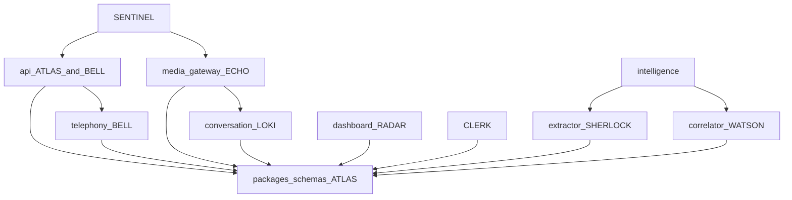

# Status

Contract version **0.1.0**. Updated by ATLAS on 2026-09-25.

The authoritative docs exist, the repository layout exists, and the shared schemas exist. The first-milestone phone call is not implemented. Stubs advertise the contracts and stop there.

## What runs today

| Target step | Skeleton |
| --- | --- |
| Test call reaches a webhook | `POST /v1/telephony/voice/mock` accepts a signed or dev-bypass body |
| Call session created | Id is returned (UUIDv5). No Postgres write |
| Audio streamed | WebSocket accepts a non-empty token, sends `ready`, discards frames |
| Speech recognized | `MockStt` returns no text |
| Response selected | `FixedResponseSelector` exists. The socket does not call it |
| TTS and audio to caller | `MockTts` returns empty bytes. The socket does not call it |
| Transcript stored | No projector |
| Intelligence extracted | `POST /v1/internal/extract` returns an empty list |
| Call on the dashboard | Vue page calls `GET /v1/calls`, which returns an empty list |

`docker-compose.yml` describes the local topology. Apps do not open Postgres or Redis clients yet. URLs are loaded so the next tickets can use them.

## Ownership map

| Path | Owner | Notes |
| --- | --- | --- |
| `docs/` | ATLAS | Source of truth for behavior and structure |
| `packages/schemas` | ATLAS | Field changes start here |
| `packages/telephony` | BELL | Carrier parsers and verifiers |
| `packages/conversation` | LOKI | Response selector |
| `packages/classification/extractor.py` | SHERLOCK | Findings |
| `packages/classification/correlator.py` | WATSON | Campaigns |
| `packages/observability` | ATLAS interface, SENTINEL redaction | Extend `REDACTED_KEYS` rather than logging beside it |
| `apps/api` read models, errors, migrations | ATLAS | |
| `apps/api` telephony routes | BELL | HTTP shapes stay aligned with `docs/API_CONTRACTS.md` |
| `apps/media_gateway` | ECHO | Calls LOKI's selector in-process |
| `apps/intelligence` extractor worker | SHERLOCK | |
| `apps/intelligence` correlator worker | WATSON | |
| `apps/dashboard` | RADAR | Read API only |
| Evidence manifest | CLERK | No app directory yet. `SB-019` adds the model |
| Auth, tokens, abuse resistance | SENTINEL | Cross-cutting. Do not fork a second webhook stack |
| `docker-compose.yml` | ATLAS | |

An agent does not take over another owner's directory to "finish" their subsystem. Cross-cutting contract edits include ATLAS (or the schema owner) in the same change.

## Dependency graph

Runtime direction for the milestone: carrier → API → media gateway → Redis → API projector and intelligence → dashboard read.

## MVP milestone

**Definition.** A test inbound call to enrolled number `+15550001001` produces, in order:

1. A carrier webhook the API accepts.
2. An `obs.call_session` row.
3. A media WebSocket carrying audio.
4. A final transcript segment from recognition.
5. A honeypot reply selected and synthesized back to the caller.
6. Stored transcript observations and conversation turns.
7. At least one proposed `IntelligenceFinding` that cites a segment.
8. A dashboard list row for that session, and a detail view that shows transcript and findings as different layers.

**Exit bar.** The eight steps above work against the mock carrier, mock STT, and mock TTS, with the dev compose file, without a live carrier account. Confidence fields are present on every interpretation and attribution. A down intelligence process does not drop the socket.

This bootstrap does not meet the exit bar. It defines the contracts the eight steps plug into.

## Engineering tickets

`Concurrent: yes` means the owner can start immediately on this tree. `Concurrent: no` means wait for the named dependencies.

| ID | Owner | Concurrent | Depends on | Work |
| --- | --- | --- | --- | --- |
| SB-001 | BELL | yes | — | Persist the mock voice webhook |
| SB-002 | BELL | yes | — | Move `VoiceInstruction` rendering into `packages/telephony` |
| SB-003 | BELL | no | SB-001, SB-016 | Status callbacks update session state and publish telephony events |
| SB-004 | ECHO | yes | — | Parse media protocol messages and validate tokens with the API |
| SB-005 | ECHO | no | SB-004, SB-016 | Mock STT emits one final segment and `speech.segment.final` |
| SB-006 | ECHO | yes | — | Mock TTS returns deterministic non-empty audio bytes |
| SB-007 | LOKI | yes | — | Selector rules for empty vs non-empty caller text, with tests |
| SB-008 | ECHO | no | SB-004, SB-005, SB-006, SB-007 | Call `respond_to_audio` from the socket and publish conversation events |
| SB-009 | SHERLOCK | yes | — | Rule extractor cites an E.164 inside a fixture transcript |
| SB-010 | SHERLOCK | no | SB-009, SB-016 | Bus consumer writes `interp.intelligence_finding` |
| SB-011 | WATSON | yes | — | Exact-match correlator on shared `callback_number` fixtures |
| SB-012 | WATSON | no | SB-010, SB-011, SB-016 | Bus consumer writes `attr.*` and campaign events |
| SB-013 | RADAR | yes | — | Dashboard list and detail bound to the read API, including empty and error states |
| SB-014 | SENTINEL | yes | — | Redis stream tokens, 60s TTL, single-use, absent from logs |
| SB-015 | SENTINEL | yes | — | Verify webhook signatures before JSON parsing; keep bypass fail-closed outside dev |
| SB-016 | ATLAS | yes | — | Redis stream publish/consume helper that calls `validate_event` |
| SB-017 | ATLAS | yes | — | Repository functions for `ops`, `obs`, `interp`, and `attr` |
| SB-018 | ATLAS | no | SB-017 | Read routes return stored rows instead of an empty list and 404 |
| SB-019 | CLERK | yes | — | Evidence manifest model with separate observation, finding, and attribution sections plus a content hash |
| SB-020 | ECHO | yes | — | Hot-path timing fields via the observability helper; a metrics failure still returns audio |

Done-when details:

- **SB-001.** `POST /v1/telephony/voice/mock` inserts `obs.webhook_receipt` and, for enrolled `to_e164`, `obs.call_session`. Unknown numbers return `403 number_not_enrolled` after the receipt insert and do not issue a token. The same `provider_call_id` returns the same session id.
- **SB-002.** The API calls a telephony renderer for `connect_stream`, `hangup`, and `reject`. Tests cover the stream-field rules already encoded on `VoiceInstruction`.
- **SB-003.** A completed status callback sets `ended_at` and publishes `telephony.call.completed`.
- **SB-004.** JSON `start`, `media`, and `stop` validate. Binary frames count as audio. A missing token closes `1008`. A present token is checked with `POST /v1/internal/stream-tokens/validate`.
- **SB-005.** A fixture frame becomes one final `SttEvent` and a published `speech.segment.final`.
- **SB-006.** `MockTts.synthesize` returns non-empty bytes for non-empty text.
- **SB-007.** Empty caller text yields confidence below `1`. Non-empty text may keep the fixed reply. No network calls.
- **SB-008.** After a final recognition, the socket runs the selector and TTS and publishes `conversation.response.selected` and `conversation.turn.recorded`.
- **SB-009.** A segment that contains an E.164 yields one `proposed` finding citing that segment. A segment without one yields nothing.
- **SB-010.** `speech.segment.final` becomes a finding row and `intelligence.finding.proposed`. Extractor exceptions do not close media sockets.
- **SB-011.** Two fixture sessions that share a callback number yield one `hypothesized` campaign and two attributions. Distinct numbers do not merge.
- **SB-012.** `intelligence.finding.proposed` creates `attr` rows and `campaign.opened` / `campaign.attribution.proposed` as appropriate.
- **SB-013.** The operator UI lists calls and shows a detail page where transcript text and findings stay visually and typedly distinct. Empty and error responses render.
- **SB-014.** The second validate of a token is `valid: false`. Expired tokens are invalid. Token values do not appear in logs.
- **SB-015.** Signature failure happens before schema errors are returned. `SWITCHBOARD_DEV_WEBHOOK_BYPASS` still does nothing unless `SWITCHBOARD_ENV=dev`.
- **SB-016.** A helper publishes a validated envelope to `switchboard.events` and a consumer group can read it.
- **SB-017.** Insert and fetch helpers exist per writer boundary. Findings still have no campaign column.
- **SB-018.** `GET /v1/calls` and `GET /v1/calls/{id}` read Postgres. Unknown ids return `call_not_found`.
- **SB-019.** A manifest model references ids in three sections and includes a hash of its canonical JSON. It does not copy finding text into an observation slot.
- **SB-020.** Durations for STT, select, and TTS can be emitted. If that emit raises, `respond_to_audio` still returns the audio bytes.

## HANDOFF — ATLAS — 2026-09-25T20:48:46Z

### Completed

- Authoritative docs: architecture, API contracts, events, data model, ADRs, security baseline, this status.
- Repository skeleton for `apps/api`, `apps/media_gateway`, `apps/intelligence`, `apps/dashboard`, and the five packages.
- Canonical Pydantic models and a TypeScript mirror for the MVP entities, envelopes, and HTTP bodies.
- Local `docker-compose.yml` for Postgres, Redis, and the four apps, plus init SQL for the three record schemas.
- Callable stubs: mock voice webhook ack, empty read models, in-memory stream tokens, media socket `ready`, null extractor.
- Contract tests for layers, confidence, event coverage, webhook auth, and the TypeScript event-name mirror.

### Files changed

- `docs/ARCHITECTURE.md`, `docs/API_CONTRACTS.md`, `docs/EVENTS.md`, `docs/DATA_MODEL.md`, `docs/DECISIONS.md`, `docs/SECURITY.md`, `docs/STATUS.md`
- `packages/schemas`, `packages/telephony`, `packages/conversation`, `packages/classification`, `packages/observability`
- `apps/api`, `apps/media_gateway`, `apps/intelligence`, `apps/dashboard`
- `docker-compose.yml`, `Makefile`, `README.md`, `.env.example`, `apps/api/migrations/`

### Interfaces added-changed

- HTTP `/v1` on the API, media WebSocket `switchboard.media.v1`, intelligence `POST /v1/internal/extract`.
- Event taxonomy in `EventType` plus `validate_event`.
- In-process ports: `SignatureVerifier`, `ResponseSelector`, `SttPort`, `TtsPort`, `FindingExtractor`, `CampaignCorrelator`.
- Postgres schemas `ops`, `obs`, `interp`, `attr`.

### Tests

- `tests/test_contracts.py`, `tests/test_api.py`, `tests/test_media_and_intelligence.py`, `tests/test_ports.py`. `make test`: 24 passed.
- `apps/dashboard` `npm run build` (`vue-tsc` and Vite) succeeded.
- Browser check against the Vite dev server: with the API up, the page shows "No calls yet" after `GET /v1/calls`. With the API stopped, the same page shows `calls_unreachable`.
- `docker compose config` was not executed in this environment. The Docker CLI is not installed. The compose file matches the topology in `docs/ARCHITECTURE.md`.

### Dependencies

- Python 3.12, Node 22, Docker Compose v2 for the full topology.
- No live carrier, STT, or TTS account. Mocks are the milestone stand-ins.
- Schema changes require a paired edit under `packages/schemas` and the matching doc.

### Blocking issues

- None that stop the tickets marked concurrent. Persistence, the event bus, real token checks on the socket, recognition, and dashboard detail data are unimplemented on purpose.
- Dev webhook bypass and the mock signature are local-only. See `docs/SECURITY.md` before any non-local run.

### Recommended next work

Start in parallel: SB-001, SB-002, SB-004, SB-006, SB-007, SB-009, SB-011, SB-013, SB-014, SB-015, SB-016, SB-017, SB-019, SB-020.

Hold: SB-003, SB-005, SB-008, SB-010, SB-012, SB-018 until their dependencies land.

ATLAS's own next implementation tickets are SB-016 and SB-017. Other agents should not wait on those unless their ticket lists them.
