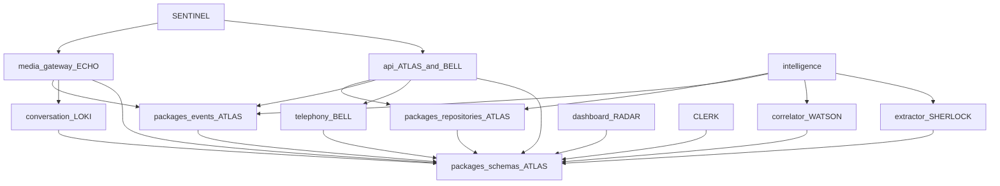

# Status

Contract version **0.1.0**. Updated by ATLAS on 2026-09-26.

The authoritative docs exist, the repository layout exists, and the shared schemas exist. The mock vertical slice is `make test-mvp-smoke`: a signed voice webhook, fixture audio, speak-back, a `callback_number` finding, and the call read API. ECHO has landed media parsing, token checks, mock STT finals, deterministic mock TTS, hot-path timing, and speak-back on the socket (SB-004, SB-005, SB-006, SB-008, SB-020). Call list and detail read stored rows (SB-018). Status callbacks update session state and publish telephony events (SB-003). The extractor consumes `speech.segment.final` into a finding and `intelligence.finding.proposed` (SB-010). The API projector stores that final and `conversation.turn.recorded`. The ops dashboard polls those call routes unless `VITE_OPS_DATA=mock` (SB-013). Campaign reads still advertise the contracts and stop there.

## What runs today

| Target step | Skeleton |
| --- | --- |
| Test call reaches a webhook | `POST /v1/telephony/voice/mock` accepts a signed or dev-bypass body |
| Call session created | Enrolled `POST /v1/telephony/voice/mock` inserts `obs.call_session` (UUIDv5) in `ringing`. `POST /v1/telephony/status/mock` moves that row forward |
| Audio streamed | WebSocket checks the token with the API, parses `start` / `media` / `stop`, and counts binary frames as audio. Each accepted frame is passed to mock STT. A non-empty final is answered with selector, TTS, and outbound `media` |
| Speech recognized | `MockStt` maps one fixture frame to one final `SttEvent` whose text is `fixture caller segment +15551234567`. The gateway publishes `speech.segment.final`. Other frames publish nothing |
| Response selected | After a final, the socket calls `FixedResponseSelector` and publishes `conversation.response.selected` |
| TTS and audio to caller | The socket sends `MockTts` audio as `media`. Inbound speech during outbound sends `clear` |
| Transcript stored | `api.projector` inserts `obs.transcript_segment` from `speech.segment.final` and `interp.conversation_turn` from `conversation.turn.recorded` |
| Intelligence extracted | `intelligence.extractor` writes `interp.intelligence_finding` and publishes `intelligence.finding.proposed` for an E.164 in `speech.segment.final`. `POST /v1/internal/extract` still proposes the same finding without the bus |
| Call on the dashboard | The Vue app polls `GET /v1/calls` and loads `GET /v1/calls/{id}` unless `VITE_OPS_DATA=mock` |

`docker-compose.yml` describes the local topology. The voice webhook writes sessions through `packages/repositories` and publishes `telephony.call.received` through `packages/events`. Status callbacks update that session through `TelephonyObsStore.apply_call_state` and publish `telephony.call.answered`, `telephony.call.completed`, or `telephony.call.failed` through the same bus. `GET /v1/calls` and `GET /v1/calls/{id}` read those rows through `read_models`. Campaign routes still return an empty list and `404`. The media gateway publishes `speech.segment.final`, `conversation.response.selected`, and `conversation.turn.recorded` for the mock STT fixture and does not open Postgres. The API projector consumes the final and the turn events into `obs.transcript_segment` and `interp.conversation_turn`. The intelligence extractor consumes `speech.segment.final`, writes `interp.intelligence_finding`, and publishes `intelligence.finding.proposed`. The dashboard polls the read API and does not open Postgres or Redis. `VITE_OPS_DATA=mock` keeps the fixture adapter.

## Ownership map

| Path | Owner | Notes |
| --- | --- | --- |
| `docs/` | ATLAS | Source of truth for behavior and structure |
| `packages/schemas` | ATLAS | Field changes start here |
| `packages/telephony` | BELL | Carrier parsers and verifiers |
| `packages/conversation` | LOKI | Response selector |
| `packages/classification/extractor.py` | SHERLOCK | Findings |
| `packages/classification/correlator.py` | WATSON | Campaigns |
| `packages/observability` | ATLAS interface, SENTINEL redaction | Extend `REDACTED_KEYS` rather than logging beside it |
| `packages/events` | ATLAS | Redis stream publish and consumer groups |
| `packages/repositories` | ATLAS | Postgres ports for `ops`, `obs`, `interp`, `attr` |
| `apps/api` read models, errors, migrations | ATLAS | |
| `apps/api` telephony routes | BELL | HTTP shapes stay aligned with `docs/API_CONTRACTS.md` |
| `apps/media_gateway` | ECHO | Calls LOKI's selector in-process |
| `apps/intelligence` extractor worker | SHERLOCK | |
| `apps/intelligence` correlator worker | WATSON | |
| `apps/dashboard` | RADAR | Read API only |
| Evidence manifest | CLERK | No app directory yet. `SB-019` adds the model |
| Auth, tokens, abuse resistance | SENTINEL | Cross-cutting. Do not fork a second webhook stack |
| `docker-compose.yml` | ATLAS | |

An agent does not take over another owner's directory to "finish" their subsystem. Cross-cutting contract edits include ATLAS (or the schema owner) in the same change.

## Dependency graph

Runtime direction for the milestone: carrier → API → media gateway → Redis → API projector and intelligence → dashboard read.

## MVP milestone

**Definition.** A test inbound call to enrolled number `+15550001001` produces, in order:

1. A carrier webhook the API accepts.
2. An `obs.call_session` row.
3. A media WebSocket carrying audio.
4. A final transcript segment from recognition.
5. A honeypot reply selected and synthesized back to the caller.
6. Stored transcript observations and conversation turns.
7. At least one proposed `IntelligenceFinding` that cites a segment.
8. A dashboard list row for that session, and a detail view that shows transcript and findings as different layers.

**Exit bar.** The eight steps above work against the mock carrier, mock STT, and mock TTS, with the dev compose file, without a live carrier account. Confidence fields are present on every interpretation and attribution. A down intelligence process does not drop the socket.

This bootstrap does not meet the exit bar. It defines the contracts the eight steps plug into.

## Engineering tickets

`Concurrent: yes` means the owner can start immediately on this tree. `Concurrent: no` means wait for the named dependencies.

| ID | Owner | Concurrent | Depends on | Work |
| --- | --- | --- | --- | --- |
| SB-001 | BELL | yes | — | Persist the mock voice webhook |
| SB-002 | BELL | yes | — | Move `VoiceInstruction` rendering into `packages/telephony` |
| SB-003 | BELL | no | SB-001, SB-016 | Status callbacks update session state and publish telephony events |
| SB-004 | ECHO | yes | — | Parse media protocol messages and validate tokens with the API |
| SB-005 | ECHO | no | SB-004, SB-016 | Mock STT emits one final segment and `speech.segment.final` |
| SB-006 | ECHO | yes | — | Mock TTS returns deterministic non-empty audio bytes |
| SB-007 | LOKI | yes | — | Selector rules for empty vs non-empty caller text, with tests |
| SB-008 | ECHO | no | SB-004, SB-005, SB-006, SB-007 | Call `respond_to_audio` from the socket and publish conversation events |
| SB-009 | SHERLOCK | yes | — | Rule extractor cites an E.164 inside a fixture transcript |
| SB-010 | SHERLOCK | no | SB-009, SB-016 | Bus consumer writes `interp.intelligence_finding` |
| SB-011 | WATSON | yes | — | Exact-match correlator on shared `callback_number` fixtures |
| SB-012 | WATSON | no | SB-010, SB-011, SB-016 | Bus consumer writes `attr.*` and campaign events |
| SB-013 | RADAR | yes | — | Dashboard list and detail bound to the read API, including empty and error states |
| SB-014 | SENTINEL | yes | — | Redis stream tokens, 60s TTL, single-use, absent from logs |
| SB-015 | SENTINEL | yes | — | Verify webhook signatures before JSON parsing; keep bypass fail-closed outside dev |
| SB-016 | ATLAS | yes | — | Redis stream publish/consume helper that calls `validate_event` |
| SB-017 | ATLAS | yes | — | Repository functions for `ops`, `obs`, `interp`, and `attr` |
| SB-018 | ATLAS | no | SB-017 | Read routes return stored rows instead of an empty list and 404 |
| SB-019 | CLERK | yes | — | Evidence manifest model with separate observation, finding, and attribution sections plus a content hash |
| SB-020 | ECHO | yes | — | Hot-path timing fields via the observability helper; a metrics failure still returns audio |

Done-when details:

- **SB-001.** `POST /v1/telephony/voice/mock` inserts `obs.webhook_receipt` and, for enrolled `to_e164`, `obs.call_session`. Unknown numbers return `403 number_not_enrolled` after the receipt insert and do not issue a token. The same `provider_call_id` returns the same session id.
- **SB-002.** The API calls a telephony renderer for `connect_stream`, `hangup`, and `reject`. Tests cover the stream-field rules already encoded on `VoiceInstruction`.
- **SB-003.** A completed status callback sets `ended_at` and publishes `telephony.call.completed`.
- **SB-004.** JSON `start`, `media`, and `stop` validate. Binary frames count as audio. A missing token closes `1008`. A present token is checked with `POST /v1/internal/stream-tokens/validate`.
- **SB-005.** A fixture frame becomes one final `SttEvent` and a published `speech.segment.final`.
- **SB-006.** `MockTts.synthesize` returns non-empty bytes for non-empty text.
- **SB-007.** Empty caller text yields confidence below `1`. Non-empty text may keep the fixed reply. No network calls.
- **SB-008.** After a final recognition, the socket runs the selector and TTS and publishes `conversation.response.selected` and `conversation.turn.recorded`.
- **SB-009.** A segment that contains an E.164 yields one `proposed` finding citing that segment. A segment without one yields nothing.
- **SB-010.** `speech.segment.final` becomes a finding row and `intelligence.finding.proposed`. Extractor exceptions do not close media sockets.
- **SB-011.** Two fixture sessions that share a callback number yield one `hypothesized` campaign and two attributions. Distinct numbers do not merge.
- **SB-012.** `intelligence.finding.proposed` creates `attr` rows and `campaign.opened` / `campaign.attribution.proposed` as appropriate.
- **SB-013.** The operator UI lists calls and shows a detail page where transcript text and findings stay visually and typedly distinct. Empty and error responses render.
- **SB-014.** The second validate of a token is `valid: false`. Expired tokens are invalid. Token values do not appear in logs.
- **SB-015.** Signature failure happens before schema errors are returned. `SWITCHBOARD_DEV_WEBHOOK_BYPASS` still does nothing unless `SWITCHBOARD_ENV=dev`.
- **SB-016.** A helper publishes a validated envelope to `switchboard.events` and a consumer group can read it.
- **SB-017.** Insert and fetch helpers exist per writer boundary. Findings still have no campaign column.
- **SB-018.** `GET /v1/calls` and `GET /v1/calls/{id}` read Postgres. Unknown ids return `call_not_found`.
- **SB-019.** A manifest model references ids in three sections and includes a hash of its canonical JSON. It does not copy finding text into an observation slot.
- **SB-020.** Durations for STT, select, and TTS can be emitted. If that emit raises, `respond_to_audio` still returns the audio bytes.

## HANDOFF — ATLAS — 2026-09-25T20:48:46Z

### Completed

- Authoritative docs: architecture, API contracts, events, data model, ADRs, security baseline, this status.
- Repository skeleton for `apps/api`, `apps/media_gateway`, `apps/intelligence`, `apps/dashboard`, and the five packages.
- Canonical Pydantic models and a TypeScript mirror for the MVP entities, envelopes, and HTTP bodies.
- Local `docker-compose.yml` for Postgres, Redis, and the four apps, plus init SQL for the three record schemas.
- Callable stubs: mock voice webhook ack, empty read models, in-memory stream tokens, media socket `ready`, null extractor.
- Contract tests for layers, confidence, event coverage, webhook auth, and the TypeScript event-name mirror.

### Files changed

- `docs/ARCHITECTURE.md`, `docs/API_CONTRACTS.md`, `docs/EVENTS.md`, `docs/DATA_MODEL.md`, `docs/DECISIONS.md`, `docs/SECURITY.md`, `docs/STATUS.md`
- `packages/schemas`, `packages/telephony`, `packages/conversation`, `packages/classification`, `packages/observability`
- `apps/api`, `apps/media_gateway`, `apps/intelligence`, `apps/dashboard`
- `docker-compose.yml`, `Makefile`, `README.md`, `.env.example`, `apps/api/migrations/`

### Interfaces added-changed

- HTTP `/v1` on the API, media WebSocket `switchboard.media.v1`, intelligence `POST /v1/internal/extract`.
- Event taxonomy in `EventType` plus `validate_event`.
- In-process ports: `SignatureVerifier`, `ResponseSelector`, `SttPort`, `TtsPort`, `FindingExtractor`, `CampaignCorrelator`.
- Postgres schemas `ops`, `obs`, `interp`, `attr`.

### Tests

- `tests/test_contracts.py`, `tests/test_api.py`, `tests/test_media_and_intelligence.py`, `tests/test_ports.py`. `make test`: 24 passed.
- `apps/dashboard` `npm run build` (`vue-tsc` and Vite) succeeded.
- Browser check against the Vite dev server: with the API up, the page shows "No calls yet" after `GET /v1/calls`. With the API stopped, the same page shows `calls_unreachable`.
- `docker compose config` was not executed in this environment. The Docker CLI is not installed. The compose file matches the topology in `docs/ARCHITECTURE.md`.

### Dependencies

- Python 3.12, Node 22, Docker Compose v2 for the full topology.
- No live carrier, STT, or TTS account. Mocks are the milestone stand-ins.
- Schema changes require a paired edit under `packages/schemas` and the matching doc.

### Blocking issues

- None that stop the tickets marked concurrent. Persistence, the event bus, real token checks on the socket, recognition, and dashboard detail data are unimplemented on purpose.
- Dev webhook bypass and the mock signature are local-only. See `docs/SECURITY.md` before any non-local run.

### Recommended next work

Start in parallel: SB-001, SB-002, SB-004, SB-006, SB-007, SB-009, SB-011, SB-013, SB-014, SB-015, SB-016, SB-017, SB-019, SB-020.

Hold: SB-003, SB-005, SB-008, SB-010, SB-012, SB-018 until their dependencies land.

ATLAS's own next implementation tickets are SB-016 and SB-017. Other agents should not wait on those unless their ticket lists them.

## HANDOFF — BELL — 2026-09-25T21:01:48Z

### Completed

- SB-001. `POST /v1/telephony/voice/mock` inserts `obs.webhook_receipt` for an accepted call, an unknown or retired `to_e164`, and a rejected signature that reaches the handler. An active enrolled number also inserts `obs.call_session` in `ringing`. Unknown and retired numbers return `403 number_not_enrolled` after that receipt commits and do not issue a token. The same `provider_call_id` returns the stored session id. A repeat webhook does not change the caller number and does not publish a second `telephony.call.received`.
- SB-002. The API calls `VoiceInstructionRenderer` for `connect_stream`, `hangup`, and `reject`. Stream-field rules stay on `VoiceInstruction`. The token is not embedded in `stream_url`. `append_stream_token` is what adds the carrier `?token=` query.

### Files changed

- `packages/telephony/switchboard_telephony/instructions.py`, `__init__.py`, `pyproject.toml`
- `apps/api/switchboard_api/routes/telephony.py`
- `apps/api/switchboard_api/obs_store.py`
- `apps/api/switchboard_api/telephony_events.py`
- `apps/api/switchboard_api/memory_tokens.py`, `settings.py`, `apps/api/pyproject.toml`
- `tests/test_instruction_renderer.py`, `tests/test_voice_webhook.py`, `tests/postgres_support.py`, `tests/conftest.py`, `tests/__init__.py`
- `docs/STATUS.md`, `docs/API_CONTRACTS.md`, `docs/ARCHITECTURE.md`, `README.md`, `Makefile`

### Interfaces added-changed

- `InstructionRenderer.render` and `append_stream_token` in `packages/telephony`. That package now imports `switchboard_schemas` for `VoiceInstruction`.
- `TelephonyObsStore` reads active `ops.operator_number` rows and writes `obs.call_session` and `obs.webhook_receipt` using `apps/api/migrations/001_init.sql`. No new tables. SB-017 should absorb these functions.
- The voice webhook publishes `telephony.call.received` with payload `TelephonyCallReceived` after `validate_event`, then `XADD switchboard.events` with a single `envelope` JSON field and approximate maxlen 100000. Only the first insert of a `(carrier, external_call_id)` publishes. A later projector must treat that event as idempotent on the unique key, because the webhook already inserted the row.
- `signature_valid` is null when the dev bypass skips the verifier. Receipt `event_type` for this route is `voice`.
- Stream tokens are still the process-local store (`SB-014`).

### Tests

- `make test`: 33 passed (the skeleton had 24). New cases live in `tests/test_voice_webhook.py` and `tests/test_instruction_renderer.py`.
- The suite applies `apps/api/migrations` to `DATABASE_URL` and expects Redis at `REDIS_URL` for the publish assertion.
- Postgres 16 and Redis 7 were running on localhost for that run. Docker Compose was not used.

### Dependencies

- `psycopg[binary]` and `redis` on `apps/api`.
- Postgres must already contain the Atlas migrations (compose init, or the pytest fixture). The API process does not migrate on startup.

### Blocking issues

- SB-003 still waits on SB-016. Status callbacks do not write and do not publish. The voice path's direct `XADD` is not the shared consumer-group helper.
- SB-015 still owns signature verification before JSON parsing. A schema-invalid body returns `422` and does not insert a receipt.
- SB-014 still owns Redis stream tokens. Issued tokens are process-local, reusable until expiry, and not single-use.
- SB-018 read routes still return an empty list, so a stored session is not on `GET /v1/calls`.
- If Redis is down, the session and receipt remain and the event is logged as `event_publish_failed` (ADR-011). There is no outbox.
- `apps/media_gateway` was not changed.

### Recommended next work

- SB-003 after SB-016: status callbacks set session state and publish `telephony.call.answered`, `telephony.call.completed`, or `telephony.call.failed`.
- SB-014, SB-015, and SB-017 can proceed in parallel. SB-017 can take over `obs_store.py` without a second schema.
- Do not merge PR #2 (`cursor/bell-telephony-slice-8abd`). This branch is the telephony slice on Atlas 0.1.0.

## HANDOFF — LOKI — 2026-09-25T20:53:06Z

### Completed

- SB-007. `FixedResponseSelector.select` still returns the fixed line `Could you repeat that?` with `strategy_id` `fixed.v1`.
- Empty or whitespace-only `latest_caller_text` sets `confidence` to `0.0` (`EMPTY_CALLER_TEXT_CONFIDENCE`), which is below `1`.
- Non-empty caller text, including text with surrounding whitespace, keeps that fixed reply at confidence `1.0`.
- The selector does not open sockets or import a network client. Spoken text stays the existing one-line prompt.

### Files changed

- `packages/conversation/switchboard_conversation/ports.py`
- `packages/conversation/switchboard_conversation/__init__.py`
- `tests/test_response_selector.py`
- `docs/STATUS.md` (this entry only)

### Interfaces added-changed

- Unchanged port: `ResponseSelector.select(ResponseRequest) -> ResponseDecision`.
- Unchanged decision fields: `text`, `strategy_id`, `confidence`. No schema or event payload was added. `ConversationResponseSelected` already carries those three decision fields plus `turn_id`, which the gateway still owns.
- New constant: `EMPTY_CALLER_TEXT_CONFIDENCE` (`0.0`), exported from `switchboard_conversation` so ECHO can read the empty-input score without guessing.

### Tests

- `tests/test_response_selector.py` covers empty and blank caller text, non-empty text, alignment with `ConversationResponseSelected`, no network imports, and `select` under a blocked socket.
- Existing `tests/test_ports.py` still expects the non-empty fixed reply at confidence `1.0`.
- `make test`: 35 passed.

### Dependencies

- `packages/schemas` hot-path models only. No Postgres, Redis, or model API.
- ECHO still calls `FixedResponseSelector` from `respond_to_audio`. This change does not edit `apps/media_gateway`. SB-008 remains the ticket that runs the selector from the socket.

### Blocking issues

- None for SB-007. The full conversation state machine is not in this slice. The earlier LOKI branch (`cursor/loki-conversation-eval-c5a2`) used a different turn JSON and is not merged here.

### Recommended next work

- ECHO SB-008: after a final recognition, call `select` and publish `conversation.response.selected` and `conversation.turn.recorded`.
- A later LOKI ticket can replace `fixed.v1` with a state machine. Keep using `ResponseDecision` until ATLAS changes the contract.

## HANDOFF — ECHO — 2026-09-25T21:01:10Z

### Completed

- SB-004. The media socket parses JSON `start`, `media`, and `stop`, treats binary frames as audio, closes `1008` when `token` is missing, and checks a present token with `POST /v1/internal/stream-tokens/validate` using `X-Switchboard-Internal-Token`.
- SB-006. `MockTts.synthesize` returns 160 deterministic `audio/pcmu` bytes (8 kHz mono, 20 ms) for non-empty text and `b""` for empty text. Local, no network.
- SB-020. `respond_to_audio` emits `stt_ms`, `select_ms`, and `tts_ms` through `log_info`. If that emit raises, the function still returns the TTS bytes.
- ECHO media requirements in `docs/API_CONTRACTS.md`: `audio/pcmu` / `audio/pcm`, 8 kHz mono default, outbound buffer, barge-in `clear`, token validation.
- Short pointer in `docs/echo/README.md`.

### Files changed

- `apps/media_gateway/switchboard_media/` (`main.py`, `protocol.py`, `tokens.py`, `hotpath.py`, `ports.py`, `settings.py`)
- `tests/test_echo_media.py`, `tests/test_media_and_intelligence.py`
- `docs/API_CONTRACTS.md`, `docs/STATUS.md`, `docs/echo/README.md`
- `docker-compose.yml` media gateway env (`API_BASE_URL`, internal token), `.env.example`

### Interfaces added-changed

- WebSocket `/v1/streams` validates tokens and media frames. It sends `ready` and still does not call STT or `respond_to_audio`.
- `MockTts` output is one 20 ms PCMU frame (160 bytes) derived from SHA-256 of the text.
- `respond_to_audio(..., *, stt, tts, selector)` emits `hotpath_timing`.
- `MediaSession.clear_outbound()` drops the outbound buffer and returns `{"event":"clear"}`.
- Wire encodings remain `audio/pcmu` and `audio/pcm`. `audio/x-mulaw` closes `1007`.

### Tests

- `tests/test_echo_media.py` covers SB-004, SB-006, and SB-020.
- `make test`: 40 passed.

### Dependencies

- Token checks call the API. Compose sets `API_BASE_URL=http://api:8000` and `SWITCHBOARD_INTERNAL_TOKEN` on the media gateway.
- SB-014 still owns the Redis single-use store. This slice uses whatever the API validate route returns.
- SB-016 is still required before `speech.segment.final` can be published.

### Blocking issues

- None for SB-004, SB-006, and SB-020.
- `docs/SECURITY.md` still says the socket only checks that the query string is non-empty. That sentence is stale after SB-004. ATLAS or SENTINEL should replace it. ECHO did not edit that file.
- The socket does not synthesize, send `clear`, or publish events.

### Recommended next work

- ECHO waits on SB-005 until SB-016 lands, then SB-008 after SB-005 and SB-007.
- SB-007 (LOKI) is still the selector rule change. This slice calls the existing `FixedResponseSelector` from `respond_to_audio` and from the timing tests. It does not add conversation policy.

## HANDOFF — SHERLOCK — 2026-09-25T21:10:00Z

SB-009. Findings are `interp.intelligence_finding` rows (`IntelligenceFinding`, `record_layer: interpretation`). This change does not add an observation table and does not emit campaign attributions.

### Completed

- `E164FindingExtractor` in `packages/classification/extractor.py`. A transcript segment whose text contains a literal E.164 token yields one `proposed` finding of kind `callback_number` citing that segment. A segment without one yields nothing. A repeated token in the same segment is one finding. Two distinct tokens are two findings, each citing that segment.
- `POST /v1/internal/extract` calls that extractor. `NullFindingExtractor` remains the empty port.
- `value` and `raw_quote` are the E.164 substring. `confidence` is `1.0` because the rule ran, not because the number is known to be a real callback. `extractor` is `e164`, `extractor_version` is `0.1.0`. Finding ids are UUIDv5 over the call, the segment, and the value.

### Files changed

- `packages/classification/switchboard_classification/extractor.py`
- `packages/classification/switchboard_classification/__init__.py`
- `apps/intelligence/switchboard_intelligence/main.py`
- `tests/test_e164_extractor.py`, `tests/test_media_and_intelligence.py`
- `docs/STATUS.md`, `docs/API_CONTRACTS.md` (the extract route no longer returns an empty list for every body)

### Interfaces added-changed

- `FindingExtractor.extract(segments) -> list[IntelligenceFinding]` now has an E.164 implementation. The finding shape is the existing `IntelligenceFinding` from `packages/schemas`. Kind used: `callback_number`. Status: `proposed`.
- No new `FindingKind` members. Loki and Watson field requests (spoken CLI versus callback, opening script, IVR path, transfer destination, script locale, normalized company, registrable domain, phrase fingerprint, identifier kind) stay off this extractor until ATLAS adds kinds in `packages/schemas` and `docs/DATA_MODEL.md`.

### Tests

- A segment containing `+15551234567` yields one proposed `callback_number` citing that segment.
- A segment with no E.164, including a formatted `(800)` number, yields nothing.
- `make test`: 30 passed, including the unit cases and `POST /v1/internal/extract`.

### Dependencies

- Canonical models from `packages/schemas` on the Atlas skeleton (`FindingKind`, `IntelligenceFinding`, `TranscriptSegment`).
- SB-010 is not started. It needs the event bus from SB-016 before `speech.segment.final` can become a stored finding and `intelligence.finding.proposed`.

### Blocking issues

- None for SB-009. Persistence of findings is still SB-017. Correlation is still WATSON (SB-011), not this extractor.

### Recommended next work

- ATLAS: extend `FindingKind` only when a new kind is agreed, then Sherlock can emit it.
- SHERLOCK: SB-010 after SB-016. Do not start it in this change.

## HANDOFF — RADAR — 2026-09-25T21:10:00Z

### Completed

- Rebased the ops dashboard from `cursor/radar-ops-dashboard-6122` onto this Atlas tree. Routes kept: `/dashboard/live`, `/dashboard/calls`, `/dashboard/calls/:id`, `/dashboard/campaigns`, `/dashboard/campaigns/:id`, `/dashboard/system`, `/dashboard/reports`, `/dashboard/reports/:reportId`.
- Mock adapter only. `apps/dashboard/src/data/client.ts` still exports `mockOpsDataPort`. No HTTP client was added.
- `docs/FRONTEND_DATA_REQUIREMENTS.md` now uses contract 0.1.0 names. Record layer is `observation` | `interpretation` | `attribution`. Call state is `CallState`. Campaign status is `hypothesized` | `corroborated` | `closed`. Findings use `FindingKind` and `status: proposed`. Technical rows use `EventType` names from `docs/EVENTS.md`.
- The same file lists UI fields that `docs/API_CONTRACTS.md` does not return. Those stay under `gaps`. Schemas were not extended.
- `apps/dashboard` still typechecks and builds (`vue-tsc`, fixture check, Vite).

### Files changed

- `apps/dashboard` (ops UI, fixtures, fixture generator, checker)
- `docs/FRONTEND_DATA_REQUIREMENTS.md`
- `docs/STATUS.md`
- `README.md` (how to run the dashboard)

### Interfaces added-changed

- `OpsDataPort` methods are unchanged in name. Their payloads now carry `CallSession`, `TranscriptSegment`, `IntelligenceFinding`, `CampaignAttribution`, `Campaign`, and `EventEnvelope` fields, plus a `gaps` object.
- Display map for CLERK `fact_class` strings is onto `RecordLayer`. `reported_caller_metadata` and `raw_observation` badge as observation. There is no unverified enum in the contract.

### Tests

- `apps/dashboard`: `npm run check:fixtures`, `npm run typecheck`, `npm run build`.
- Browser check against the Vite preview: live board, call history, call detail, campaign list and detail, system, reports, unknown call id, unknown report id.

### Dependencies

- Dashboard runtime: `vue`, `vue-router`, `pinia`. Dev: `vite`, `vue-tsc`, `typescript`.
- TypeScript types import `@switchboard/schemas` (`packages/schemas/ts`). The dashboard image already copies that tree.

### Blocking issues

- None for the mock UI. The read API is still the empty stub, so the screens cannot bind to it yet.

### Recommended next work

- **SB-013** (RADAR, still open). Swap `opsData` for an HTTP adapter on `GET /v1/calls` and `GET /v1/calls/{id}` once **SB-018** returns stored rows. Keep transcript segments and findings visually separate. Render empty list and `call_not_found`. Do not invent gap fields on the wire.
- Leave campaign volume, dialogue beats, classification, latency, cost, and the report catalog as gaps until ATLAS or CLERK add a route. `SB-019` is CLERK's manifest, not this report index.
- `docs/API_CONTRACTS.md` still says the Vue app calls `GET /v1/calls` once on load. That describes the skeleton stub this dashboard replaced. The ops UI does not call the API. ATLAS should update that paragraph when the HTTP adapter lands.

## HANDOFF — SENTINEL — 2026-09-25T15:58:40-05:00

This handoff sits on the ATLAS skeleton. It does not replace the handoff above. Webhook verification stays `switchboard_telephony.MockSignatureVerifier`. There is no second signature package.

### Completed

- Deepened `docs/SECURITY.md` on top of the ATLAS baseline: threat model, failure-mode matrix, implementer checklist, and recommended alerts.
- `SB-015` signature-before-parse is **closed** on `POST /v1/telephony/voice/{provider}` and `POST /v1/telephony/status/{provider}`. Size and the in-process rate limit run first, then the mock header or the dev bypass, then JSON validation. Unsigned garbage is `401`. Signed garbage is `422`. `SWITCHBOARD_DEV_WEBHOOK_BYPASS` is still ignored unless `SWITCHBOARD_ENV=dev`.
- Webhook body cap is 1 MiB (`413 webhook_too_large`). The shared voice/status window defaults to 600 events per minute per client host (`429 webhook_rate_limited`).
- Media frames pass `admit_frame` before they are discarded. A deny closes the socket with `1008`.
- `GET /health` can probe Postgres and Redis TCP when `SWITCHBOARD_HEALTH_PROBES=1`. The flag is off by default, so `status: ok` still means process liveness.
- Adversarial fixtures target the mock header `X-Switchboard-Mock-Signature: dev`.

### Files changed

- `docs/SECURITY.md`, `docs/API_CONTRACTS.md`, `docs/STATUS.md`
- `apps/api/switchboard_api/routes/telephony.py`, `routes/health.py`, `settings.py`, `webhook_edge.py`, `health_probes.py`
- `apps/media_gateway/switchboard_media/main.py`, `budgets.py`
- `packages/telephony/switchboard_telephony/ports.py` (docstring only; verifier behavior unchanged)
- `sentinel/limits.py`, `sentinel/fixtures/webhook_attacks.py`, `sentinel/__init__.py`
- `tests/test_signatures.py`, `tests/test_webhook_edge.py`, `tests/test_limits.py`, `tests/test_media_and_intelligence.py`, `tests/test_runtime_gaps.py`, `tests/test_fixture_imports.py`, `tests/conftest.py`
- `Makefile`, `pytest.ini`, `pyproject.toml`, `README.md`

### Interfaces added-changed

- Admission order on the mock voice and status routes: size, per-host rate limit, signature, then schema. Error codes `webhook_too_large`, `webhook_rate_limited`, and `dependencies_unavailable`.
- `sentinel.limits.KeyedEventLimiter` and `switchboard_media.budgets.admit_frame`.
- `SWITCHBOARD_HEALTH_PROBES=1` opts `GET /health` into TCP checks of `DATABASE_URL` and `REDIS_URL`.
- The mock verifier is unchanged: header `x-switchboard-mock-signature` must equal `dev`. It does not cover the body.

### Tests

- `python3 -m pytest`: 62 passed, 2 skipped. The skips are the open-control tripwires below.
- New coverage: unsigned body before schema errors, signed garbage, webhook rate limit, body cap, health probes on and off, oversized media frame, keyed limiter, fixture header matching the telephony package.
- Skipped tripwires: `SB-014` Redis token store, operator authentication. They fail if those modules appear without the named check.

### Dependencies

- This branch is based on `cursor/atlas-architecture-skeleton-05c7` (pull request 9), not on a merge of that work into `main`.
- No live carrier, STT, TTS, or model account.
- No new third-party security library. Limits and fixtures stay in the repo-root `sentinel` package.

### Blocking issues

- **`SB-014` is open.** Stream tokens are still process-local, still last 60 seconds, and a second validate still returns `valid: true`. They are not in Redis and they are not single-use. Do not treat the in-memory store as the control.
- **`SB-004` is open** for token checks on the socket. Byte accounting is in place and is not a substitute.
- **Operator authentication is open** on the read API and the dashboard.
- **Health probes are partial.** They are off in compose, and a successful probe is a TCP accept, not a query. Apps still do not open Postgres or Redis (`SB-017`).
- The webhook rate limit is not shared across API processes. The mock signature does not authenticate the body. Production HMAC belongs beside `MockSignatureVerifier`.
- The media socket does not enforce call duration or jitter. Those helpers are tested and unwired.

### Recommended next work

- `SB-014`: Redis stream tokens, single-use, 60 second TTL, absent from logs.
- `SB-004`: validate the token with the API before `ready`, then keep `admit_frame`.
- Operator authentication on the read API before any non-local dashboard deploy.
- When `SB-017` adds repositories, turn health probes on in the deployment that should fail closed, and keep them off for the local compose file until those clients exist.
- BELL adds a real `SignatureVerifier` next to the mock class when a carrier is chosen. Dedupe stays on `provider_call_id` (`SB-001`).

## HANDOFF — ATLAS — 2026-09-25T23:33:52Z

### Completed

- Rebased SB-016 and SB-017 onto main `caea035` (specialist stack #12/#10/#11/#13/#14/#5).
- SB-016. `packages/events` publishes a validated `EventEnvelope` to `switchboard.events` and reads it through `api.projector`, `intelligence.extractor`, and `intelligence.correlator`. The entry is still one `envelope` JSON field, approximate maxlen 100000. The same `event_id` does not append twice. `ack` dedupes redelivery for that group. Redis publish failures log `event_publish_failed` and return `PublishResult.failed`. They do not raise and do not roll back a committed session (ADR-011).
- Bell's direct `XADD` in `switchboard_api.telephony_events` now calls `EventBus.publish`. `EVENT_STREAM_KEY` is still `switchboard.events`. `telephony_call_received_envelope` still builds `telephony.call.received`. The voice route is unchanged: it publishes only on the first insert of `(carrier, external_call_id)`.
- SB-017. `packages/repositories` is the Postgres port for `ops`, `obs`, `interp`, and `attr` on `001_init.sql`. No new migration. `switchboard_api.obs_store.get_obs_store` returns that `TelephonyObsStore`, so SB-001 keeps active-operator lookup, the idempotent ringing insert, and the append-only receipt. Findings have no campaign column.

### Files changed

- `packages/events`, `packages/repositories`
- `apps/api/switchboard_api/telephony_events.py`, `obs_store.py`, `deps.py`, `settings.py`, `apps/api/Dockerfile`
- `apps/media_gateway/switchboard_media/events.py`, `apps/media_gateway/Dockerfile`
- `apps/intelligence/switchboard_intelligence/deps.py`, `apps/intelligence/Dockerfile`
- `tests/test_event_bus.py`, `tests/test_repositories.py`, `tests/db_support.py`
- `docs/EVENTS.md`, `docs/DATA_MODEL.md`, `docs/ARCHITECTURE.md`, `docs/API_CONTRACTS.md`, `docs/STATUS.md`, `README.md`, `Makefile`, `pytest.ini`

### Interfaces added-changed

- `EventBus.publish`, `EventBus.read`, `EventBus.ack`, `build_envelope`, `ConsumerGroup`.
- `publish_envelope` returns `PublishResult` and no longer opens its own Redis client.
- `observation_writer`, `finding_writer`, `attribution_writer`, `read_models`, `unit_of_work`.
- `TelephonyObsStore.find_active_operator_id`, `insert_ringing_session` → `(id, created)`, `insert_webhook_receipt` → receipt id.

### Tests

- `make test`: 123 passed, 2 skipped. The skips are the existing SB-014 and operator-auth tripwires.
- SB-001/SB-002 cases in `tests/test_voice_webhook.py` and `tests/test_instruction_renderer.py` passed, including one published envelope for a repeated `provider_call_id`, a null `call_session_id` on a rejected number, and a stored session when Redis is down.
- New cases: `tests/test_event_bus.py` (Redis db 15) and `tests/test_repositories.py`.
- Docker Compose was not executed. The Docker CLI is not installed here.

### Dependencies

- `redis` on `packages/events`. `psycopg[binary]` on `packages/repositories`. The API image installs both.
- The suite needs Postgres at `DATABASE_URL` and Redis at `REDIS_URL`.

### Blocking issues

- SB-003, SB-005, SB-008, SB-010, and SB-012 can use the bus. This change does not add those handlers. SB-018 can use `read_models` and is not wired to the read routes.
- No transactional outbox. A crash between commit and publish can still drop an event (ADR-011).
- Idempotency keys live for the life of the Redis instance.

### Recommended next work

- SB-003: `CallSessionRepository.apply_state` and `publish_envelope` for answered, completed, and failed.
- SB-010: `EventBus.read(ConsumerGroup.INTELLIGENCE_EXTRACTOR, ...)` and `finding_writer`.
- SB-012: `ConsumerGroup.INTELLIGENCE_CORRELATOR` and `attribution_writer`.
- SB-005 / SB-008: publish from `switchboard_media.events.event_bus`.
- SB-018: `open_read_models` for the call list and detail routes.

## HANDOFF — ATLAS — 2026-09-25T23:40:16Z

### Completed

- SB-018. `GET /v1/calls` and `GET /v1/calls/{id}` read Postgres through `open_read_models` (`packages/repositories`). Unknown ids return `404 call_not_found`.
- The list is `CallSessionSummary`: `id`, `state`, `caller_number_e164`, `called_number_e164`, `started_at`, `ended_at`. Order is newest `started_at`, then `id`. `limit` is 1–200, default 50. `next_cursor` is the repository's opaque cursor. A cursor that does not decode is `422 invalid_request`, and the cursor value is not echoed. An empty table is `items: []`, `next_cursor: null`.
- Detail is `CallDetailResponse`: `session`, `media_streams`, and `transcript` are observations; `turns` and `findings` are interpretations; `attributions` are attribution. A known session with no child rows returns empty arrays. Transcript, findings, and attribution sub-routes return the same rows, or `404 call_not_found` when the session is missing.
- There is no live route. `in_progress` sessions are in `GET /v1/calls`. RADAR can filter that list for the live board.
- Operator authentication is still the open tripwire. These routes do not import `switchboard_api.operator_auth` and do not require a credential, matching the other read routes and `docs/SECURITY.md`.
- Campaign routes are unchanged stubs. The dashboard was not edited (`SB-013`).

### Files changed

- `apps/api/switchboard_api/routes/calls.py`, `deps.py`
- `tests/test_call_reads.py`
- `docs/API_CONTRACTS.md`, `docs/ARCHITECTURE.md`, `docs/DATA_MODEL.md`, `docs/STATUS.md`, `README.md`

### Interfaces added-changed

- No schema fields were added. `CallListResponse` and `CallDetailResponse` are the existing models.
- Call routes call `ReadModels` (`call_sessions.list_page` / `get`, plus `list_for_session` on media streams, transcripts, turns, findings, and attributions). No ad-hoc SQL in the route.

### Tests

- `tests/test_call_reads.py` inserts sessions through `open_observation_writer`, findings through `open_finding_writer`, and attributions through `open_attribution_writer`, then asserts the HTTP bodies.
- Covered: empty list, unknown id on detail and the three sub-routes, limit bounds, bad cursor, default limit 50, a signed voice webhook on the list, newest-first pages, `in_progress` and `completed` rows, and detail layers kept apart (`observation` transcript, `interpretation` finding, `attribution` link).
- `make test`: 128 passed, 2 skipped. The skips are the existing SB-014 and operator-auth tripwires. The previous suite on main was 123 passed, 2 skipped.

### Dependencies

- `packages/repositories` and Postgres at `DATABASE_URL`. The API process still does not migrate on startup.
- No new third-party library.

### Blocking issues

- Operator authentication on the read API is still open. Do not publish port 8000 as if that were access control.
- Campaign list and detail are still empty stubs.
- The dashboard still binds `mockOpsDataPort`. SB-013 can switch `fetchCallHistory` and `fetchCallDetail` to these routes. Gap fields in `docs/FRONTEND_DATA_REQUIREMENTS.md` are still absent on the wire.

### Recommended next work

- RADAR SB-013: HTTP adapter for `GET /v1/calls` and `GET /v1/calls/{id}`. Render an empty list and `call_not_found`. Keep transcript segments and findings visually separate. Poll the list for the live board. Do not invent gap fields.
- SENTINEL: operator authentication before any shared deployment. The tripwire in `tests/test_runtime_gaps.py` still skips until `switchboard_api.operator_auth` exists.
- Campaign reads stay a later ATLAS ticket. This change does not start them.

## HANDOFF — BELL — 2026-09-25T23:43:46Z

### Completed

- SB-003. `POST /v1/telephony/status/{provider}` verifies the mock signature on the raw body, then updates `obs.call_session` through `TelephonyObsStore.apply_call_state` (`CallSessionRepository.apply_state`) and publishes through `publish_envelope` / `EventBus`.
- `in_progress` sets `answered_at` and publishes `telephony.call.answered`. `completed` sets `ended_at` and publishes `telephony.call.completed`. `failed` sets `ended_at` and publishes `telephony.call.failed`. A `failed` callback with no `end_reason` stores and publishes `failed`.
- A repeat of the stored state leaves `answered_at` and `ended_at` in place. The status event id is UUIDv5(`SWITCHBOARD_ID_NAMESPACE`, `{call_session_id}:{event_type}`), so the duplicate does not append a second stream entry. A retry after a lost publish can still write that one entry.
- An unknown `provider_call_id` is `404 call_not_found`. A backward transition is `409 state_conflict`. Signature failure stays `401 webhook_unauthorized` and does not change the session. Signed non-JSON stays `422` and does not insert a receipt.
- Each accepted callback, unknown-call callback, and signature-rejected JSON object inserts `obs.webhook_receipt` with `event_type` `status`. A rejected signature does not look up `provider_call_id`, so that receipt's `call_session_id` is null.
- Publish still happens after the Postgres commit. Redis failure returns `PublishResult.failed`, logs `event_publish_failed`, and does not roll back the session (ADR-011). No private `XADD`.

### Files changed

- `apps/api/switchboard_api/routes/telephony.py`
- `apps/api/switchboard_api/telephony_events.py`
- `apps/api/switchboard_api/obs_store.py`
- `packages/repositories/switchboard_repositories/telephony_store.py`
- `tests/test_status_callback.py`
- `docs/API_CONTRACTS.md`, `docs/DATA_MODEL.md`, `docs/STATUS.md`

### Interfaces added-changed

- `TelephonyObsStore.get_call_session` and `TelephonyObsStore.apply_call_state`. No new table and no new migration.
- `telephony_call_answered_envelope`, `telephony_call_completed_envelope`, and `telephony_call_failed_envelope`. They call `build_envelope`, which calls `validate_event`, then `publish_envelope`.
- Status receipt `event_type` is `status`. Voice receipts stay `voice`.
- `404 call_not_found` now also covers an unknown status callback. `409 state_conflict` is the backward-transition response.

### Tests

- `make test`: 134 passed, 2 skipped. The skips are the existing SB-014 and operator-auth tripwires.
- New cases in `tests/test_status_callback.py`: completed sets `ended_at` and publishes one `telephony.call.completed` even when the callback is repeated with a later timestamp; answered then completed keeps `answered_at`; failed sets `ended_at` and publishes `telephony.call.failed`; a missing `end_reason` on failed uses `failed`; ringing publishes no extra telephony event; signature rejection, unsigned garbage, and signed garbage; unknown call; backward transition; Redis outage still sets `ended_at`.
- Postgres at `DATABASE_URL` and Redis at `REDIS_URL`. Docker Compose was not executed.

### Dependencies

- No new packages. SB-001 and SB-016 were already on main (`5d4bf44`).

### Blocking issues

- No projector consumes these events yet. The webhook writes the session itself, the same way the voice route inserts `ringing` before `telephony.call.received`. A later projector must treat the status event as idempotent on the session.
- A crash after commit and before a successful publish can still drop the event until the carrier retries that same status (ADR-011). The deterministic event id makes that retry safe.
- `GET /v1/calls` is still the SB-018 stub, so the updated session is not on the read API.
- `apps/media_gateway` was not changed. Stream disconnect still does not end the session; the carrier status callback does.

### Recommended next work

- SB-018 can read the session this route now updates.
- SB-005 / SB-008 publish from `switchboard_media.events.event_bus`. Do not add a second Redis writer.
- A future projector for `api.projector` should no-op when the session is already in the event's state.

## HANDOFF — ECHO — 2026-09-25T23:41:39Z

### Completed

- SB-005. `MockStt.push_audio` maps `MOCK_STT_FIXTURE_FRAME` (160 bytes of `0xFF`, one 20 ms PCMU frame) to one final `SttEvent`: text `fixture caller segment`, `is_final` true, `stt_confidence` `1.0`, offsets `0` and `20`. Every other payload returns `[]`. The mock does not decode samples and does not call a provider.
- The media socket passes each accepted audio frame to `recognize_frame`. A non-empty final is published as `speech.segment.final` through `switchboard_media.events.event_bus` (`EventBus.publish` / `build_envelope` on `switchboard.events`). Producer is `media_gateway`. Speaker is `caller`. `sequence` starts at `0` per socket and advances only when the publish is not `failed`.
- A Redis failure returns `PublishResult.failed`, logs `event_publish_failed`, and leaves the socket up. The transcript text and the audio bytes are not logged and are not fields on the stream entry.
- The socket does not call `respond_to_audio`. Selector and TTS on the socket remain SB-008.

### Files changed

- `apps/media_gateway/switchboard_media/ports.py`, `recognition.py`, `main.py`, `hotpath.py`
- `tests/test_echo_stt.py`
- `docs/API_CONTRACTS.md`, `docs/STATUS.md`, `docs/echo/README.md`, `docs/SECURITY.md` (STT failure-mode cell only)

### Interfaces added-changed

- `MockStt` now returns one final for the fixture frame. `SttPort.push_audio` is unchanged.
- `recognize_frame(call_session_id, payload, *, sequence, stt=None, bus=None) -> RecognitionResult`. `RecognitionResult.events` is every event from the port. `next_sequence` counts published finals.
- Publish path: `build_envelope` then `EventBus.publish`. No private `XADD`. No conversation-package change.

### Tests

- `tests/test_echo_stt.py`: fixture frame is one final; other frames publish nothing; partials and empty text are not published; two finals take sequence `0` then `1`; a bad Redis URL does not raise or advance sequence; the socket publishes `speech.segment.final` that `api.projector` and `intelligence.extractor` can read.
- `make test`: 130 passed, 2 skipped. The skips are the existing SB-014 and operator-auth tripwires. The socket case uses Redis db 15 and flushes that db.

### Dependencies

- SB-004 media parser and SB-016 `EventBus` on main `5d4bf44`.
- No live STT account. The fixture text is the mock stand-in, not a decode of the PCMU bytes.

### Blocking issues

- None for SB-005.
- SB-008 is still open. The socket already publishes the segment. The next change should take `RecognitionResult.events` and run the selector and TTS from that text. It should not call `push_audio` a second time on the same frame, or the caller will be recognized twice.
- Transcript `sequence` is per socket, starting at `0`. A second socket on the same call can publish sequence `0` again. The milestone uses one stream per call.
- `docs/SECURITY.md` still says `MockTts` returns empty bytes. That sentence is stale after SB-006. ECHO updated only the STT row in this change.

### Recommended next work

- ECHO SB-008: after `recognize_frame` returns a final, call LOKI's `ResponseSelector` and `MockTts`, write the audio to the socket, and publish `conversation.response.selected` and `conversation.turn.recorded` through the same `event_bus()`.
- SHERLOCK SB-010 can consume `speech.segment.final` from `ConsumerGroup.INTELLIGENCE_EXTRACTOR`. The stored row's `provider` (`mock-stt` in `docs/DATA_MODEL.md`) is the projector's field. It is not on `SpeechSegmentPayload`.

## HANDOFF — SHERLOCK — 2026-09-25T23:45:14Z

SB-010. `speech.segment.final` is consumed by `intelligence.extractor`. A literal E.164 becomes one `interp.intelligence_finding` row and one `intelligence.finding.proposed` event. This change does not add a `FindingKind`, does not write `obs.*`, and does not emit campaign attributions.

### Completed

- `ExtractorConsumer` in `apps/intelligence/switchboard_intelligence/extractor_worker.py` reads `ConsumerGroup.INTELLIGENCE_EXTRACTOR` through `switchboard_intelligence.deps.event_bus`. `speech.segment.final` is adapted to one in-memory `TranscriptSegment` and passed to `E164FindingExtractor`. Each finding is inserted with `finding_writer` and published with `EventBus.publish`. The proposed event id is a UUIDv5 of the finding id. `confidence` on that event is the finding's confidence.
- A final segment with no E.164, and every other event type including `speech.segment.partial`, is acknowledged and does not insert a row or publish a proposal.
- Extractor exceptions are logged as `extractor_failed` with the event id, event type, call session id, and a fixed reason. The transcript and the exception message are not logged. The entry is acknowledged so the group continues. A later final segment still becomes a finding. The media socket stays open and still accepts `start`, a binary frame, and `stop` (`1000`).
- A failed insert or a failed publish leaves the source entry pending. Redis errors in the loop are logged as `extractor_poll_failed` and the loop continues.
- The same `event_id` handled twice inserts one row. `EventBus.ack` drops a later copy of that id before `extract` runs again. Finding ids stay the SB-009 UUIDv5.
- The intelligence process starts this loop from its FastAPI lifespan when `DATABASE_URL` and `REDIS_URL` are set. `SWITCHBOARD_EXTRACTOR_WORKER=0` leaves it off. Pytest leaves it off unless that flag is `1`. `POST /v1/internal/extract` is unchanged.

### Files changed

- `apps/intelligence/switchboard_intelligence/extractor_worker.py`
- `apps/intelligence/switchboard_intelligence/main.py`
- `apps/intelligence/switchboard_intelligence/deps.py` (docstring only)
- `packages/classification/switchboard_classification/extractor.py` (docstring: `stt_confidence` is not finding confidence)
- `tests/test_extractor_consumer.py`
- `docs/API_CONTRACTS.md`, `docs/STATUS.md`

### Interfaces added-changed

- `ExtractorConsumer.poll` / `handle`, `transcript_from_final`, `finding_proposed_envelope`, `serve_extractor`.
- No new `FindingKind`. No change to `IntelligenceFinding` or `SpeechSegmentPayload`.
- `stt_confidence` is placed on the in-memory segment only. It is not a field of `IntelligenceFindingProposed` and it is not written into `IntelligenceFinding.confidence`.

### Tests

- Final segment containing `+15551234567` with `stt_confidence` `0.25` stores one `callback_number` whose confidence is `1.0`, cites that segment, and publishes one `intelligence.finding.proposed`. No `obs.transcript_segment` row is written. A following non-speech event is acknowledged and does not block the final.
- A final segment without an E.164, and a partial that contains one, store nothing and publish nothing.
- An extractor exception is acknowledged, omitted from the finding table, and absent from the log as transcript text. The next final still lands. A media socket that is already `ready` still closes with `1000` after `start`, audio, and `stop`.
- Two handles of one delivery, then a raw re-append of the same `event_id`, leave one finding and one proposed event. The re-append does not call `extract` again.
- `make test`: 130 passed, 2 skipped. The skips are the existing SB-014 and operator-auth tripwires.

### Dependencies

- SB-009 `E164FindingExtractor` and UUIDv5 finding ids.
- SB-016 `EventBus` and SB-017 `finding_writer`. The finding's `call_session_id` must already exist; this consumer does not insert the session.

### Blocking issues

- None for SB-010. `docs/SECURITY.md` still says extractor exceptions must not close sockets when SB-010 lands, and that extract returns an empty list. Both sentences are stale. SENTINEL or ATLAS should replace them. This change did not edit that file.
- A missing `obs.call_session` makes the insert fail and leaves the entry pending, which holds the group's later entries behind it until the session row exists.
- No transactional outbox. A crash after the finding commit and before a successful publish is recovered by redelivery because the proposed event id is stable. A crash that loses the Redis entry still loses the proposal (ADR-011). The finding row remains.

### Recommended next work

- WATSON: SB-012 can consume `intelligence.finding.proposed` on `intelligence.correlator` and write `attr.*`.
- ECHO: SB-005 publishes `speech.segment.final` from the media gateway. This consumer is ready for that event.
- SENTINEL: update the extractor row in the `docs/SECURITY.md` failure-mode matrix.

## HANDOFF — WATSON — 2026-09-25T23:53:30Z

SB-011. Attributions are `attr.campaign_attribution` rows (`CampaignAttribution`, `record_layer: attribution`). Campaigns are `attr.campaign` rows with status `hypothesized`. This change does not write findings, does not add a campaign column, and does not consume the bus.

### Completed

- `ExactCallbackCorrelator` in `packages/classification/switchboard_classification/correlator.py`. It implements `CampaignCorrelator.propose(CorrelationInput) -> list[CampaignAttribution]`.
- Primary rule: `FindingKind.callback_number` values that are the same E.164 (`packages/schemas` `E164` pattern) associate calls. The rationale names that kind and that value. `confidence` is `1.0` because the strings were identical, not because the cluster is corroborated. `method` is `exact_callback_number`, `method_version` is `0.1.0`.
- A callback that only one call session has stays unmatched: no campaign and no attribution. When a second session shares that E.164 and no campaign exists yet, the correlator opens one `hypothesized` campaign and one attribution per session. Each attribution cites that session's finding ids. A later session with the same number joins that campaign.
- Distinct E.164 values do not merge. Two shared numbers become two campaigns. A call can carry one attribution per number.
- Rejected findings, non-callback kinds, values that are not E.164, and findings whose `call_session_id` is not the input's session do not match. Proposing the same session twice does not open a campaign by itself.
- Campaign id is UUIDv5 of `campaign|exact_callback_number|{e164}` in `SWITCHBOARD_ID_NAMESPACE`. Attribution id is UUIDv5 of `campaign_attribution|{campaign_id}|{call_session_id}|exact_callback_number`. `supporting_finding_ids` are the matching findings known on that call when the attribution is first proposed. A later propose of an already attributed call returns `[]` and does not mint a second row.
- `NullCampaignCorrelator` still returns `[]`. The objects are the existing `Campaign` and `CampaignAttribution` models. `PostgresCampaigns.insert` and `PostgresAttributions.insert` can persist them. This change does not call them.
- SB-012 is not started. No Redis consumer, no `campaign.opened` publish, no `campaign.attribution.proposed` publish.

### Files changed

- `packages/classification/switchboard_classification/correlator.py`
- `packages/classification/switchboard_classification/__init__.py`
- `tests/test_exact_callback_correlator.py`
- `docs/API_CONTRACTS.md` (correlator port row)
- `docs/STATUS.md`

### Interfaces added-changed

- `ExactCallbackCorrelator.propose` returns the attributions created by that call. When the call opens a campaign, the list includes an attribution for every session that was waiting on that number. `campaigns()` and `attributions()` are the in-memory `attr.campaign` and `attr.campaign_attribution` sets.
- No schema change. No new `FindingKind`. No repository method. `apps/intelligence` does not construct this correlator yet.

### Tests

- `tests/test_exact_callback_correlator.py`. Shared `+15551234567` yields one `hypothesized` campaign and two attributions that cite the two finding ids. Distinct numbers yield no campaign. A third session joins the existing campaign. Two shared numbers stay two campaigns. Rejected, non-E.164, pretext, and mismatched session ids do not merge. An accepted finding matches a proposed one. Replay keeps one campaign and the same ids.
- `make test`: 136 passed, 2 skipped. The skips are the existing SB-014 and operator-auth tripwires. The previous suite on main was 128 passed, 2 skipped.

### Dependencies

- Canonical models from `packages/schemas` (`IntelligenceFinding`, `Campaign`, `CampaignAttribution`, `FindingKind`, `CampaignStatus`, `E164`).
- SB-012 still needs SB-010 (open as PR #19) before `intelligence.finding.proposed` can feed this rule. SB-016 is already on main. This correlator's memory is process-local, so the consumer must not assume the dict survives a restart.

### Blocking issues

- None for SB-011. Nothing is written to `attr.*` until SB-012. A second intelligence process would not see this process's unmatched callbacks.

### Recommended next work

- WATSON SB-012, after SB-010: consume `intelligence.finding.proposed` on `ConsumerGroup.INTELLIGENCE_CORRELATOR`, load prior `callback_number` findings for the same E.164, and insert through `attribution_writer` (`campaigns().insert`, `attributions().insert`). Publish `campaign.opened` when the campaign row is new and `campaign.attribution.proposed` for each new attribution. Keep the UUIDv5 ids so those inserts stay idempotent. Do not move a campaign to `corroborated` from this rule.
- Leave the extractor and `FindingKind` alone.

## HANDOFF — ECHO — 2026-09-25T23:58:07Z

### Completed

- SB-008. After `recognize_frame` returns a non-empty final, the socket calls `respond_to_audio` with those finals. `push_audio` is not called a second time on the same frame. The selector is LOKI's `FixedResponseSelector`. TTS is `MockTts`.
- The socket publishes, through `switchboard_media.events.event_bus` (`build_envelope` then `EventBus.publish`): a caller `conversation.turn.recorded` (`strategy_id` null, confidence `1.0`), `conversation.response.selected`, and a honeypot `conversation.turn.recorded` that shares the selected event's `turn_id`. Caller indexes are 0, 2, 4. Honeypot indexes are 1, 3, 5.
- Non-empty audio is written as `media` (`sequence` from 0, `timestamp_ms` of `sequence * 20`). A later final while that reply is still outbound sends `clear` before the next `media`. A frame with no final does not send `clear`.
- A Redis failure logs `event_publish_failed` and does not close the socket. The caller still receives the synthesized frame. A selector or TTS exception logs `hotpath_reply_failed` and leaves the socket up. Transcript text, reply text, and audio are not logged.

### Files changed

- `apps/media_gateway/switchboard_media/main.py`, `hotpath.py`, `recognition.py`, `reply.py`, `events.py`, `protocol.py`
- `tests/test_echo_speak.py`, `tests/test_echo_stt.py`
- `docs/API_CONTRACTS.md`, `docs/STATUS.md`, `docs/echo/README.md`, `docs/SECURITY.md` (STT and TTS failure-mode cells)

### Interfaces added-changed

- `respond_to_audio(..., recognized=None, decisions=None)`. `recognized` skips a second `push_audio`. `decisions` receives the `ResponseDecision` the audio was synthesized from. The return value is still the audio bytes. No conversation-package change.
- `recognize_frame` now also returns `RecognitionResult.finals` (`RecognizedFinal`: event, transcript segment id, speech event id, published). `events` and `next_sequence` are unchanged.
- `record_exchange(call_session_id, turn_index, finals, decision, *, bus=None) -> int`.
- `publish_validated` is the shared Redis-failure wrapper. No private `XADD`.

### Tests

- `tests/test_echo_speak.py`: recognized finals do not call STT again; the three conversation envelopes; a bad Redis URL does not raise; playback `clear`; the socket sends `MockTts` audio and the bus events; noise does not `clear`; a second final sends `clear` then the next `media`; Redis down still sends audio and closes `1000`; a selector exception does not close the socket.
- `tests/test_echo_stt.py` still asserts the two `speech.segment.final` envelopes. It now drains outbound `media` / `clear` before the close.
- `make test`: 161 passed, 2 skipped. The skips are the existing SB-014 and operator-auth tripwires. The socket cases use Redis db 15 and flush that db. Main before this change was 153 passed, 2 skipped.

### Dependencies

- SB-005 on main `e045b9e`, SB-006, SB-007, and SB-016 `EventBus`. This branch is based on main `62e8ed2`.
- No live STT or TTS account. The reply text is `Could you repeat that?` from `FixedResponseSelector`.

### Blocking issues

- None for SB-008.
- There is still no API projector for `conversation.response.selected` or `conversation.turn.recorded`. The gateway does not write Postgres.
- Transcript `sequence` is still per socket. A second socket on the same call can publish sequence `0` again.
- `docs/SECURITY.md` extractor row is still the pre-SB-010 sentence. This change did not edit that row.

### Recommended next work

- ATLAS: project `conversation.turn.recorded` into `interp.conversation_turn` and `speech.segment.final` into `obs.transcript_segment`.
- WATSON SB-012 can consume `intelligence.finding.proposed`. The fixture transcript has no E.164, so SB-008 does not by itself open a finding.

## HANDOFF — RADAR — 2026-09-25T23:56:16Z

SB-013. The ops dashboard reads stored calls from the API. Campaigns, system, and reports stay on fixtures.

### Completed

- `VITE_OPS_DATA=mock` keeps `mockOpsDataPort`. Any other value, including unset, binds call list, live board, and call detail to the read API. Campaign, system, and report methods still delegate to the mock port. No campaign endpoint was added.
- Live board polls `GET /v1/calls` (default every 5 seconds, `VITE_LIVE_POLL_MS`) and keeps rows whose `state` is `in_progress`. Each of those ids is loaded with `GET /v1/calls/{id}` so the rail can show transcript segments and `IntelligenceFinding` rows. `ringing` stays off the live board and remains on the history list.
- History is the same list, newest `started_at` first, following `next_cursor` at `limit=200` for at most 20 pages. `CallSessionSummary` does not include `external_call_id`, so the history row leaves the carrier id blank.
- Detail maps `CallDetailResponse` onto the existing screen: media streams and transcript stay observations, turns and findings stay interpretations, attributions stay attribution. `events` is empty. `404` with `call_not_found` is the empty state. A refused connection surfaces as `calls_unreachable`. An empty list renders "No calls yet" and "No in-progress calls".
- Gap columns are not written onto the wire. Duration is derived from `started_at` and `ended_at`. Engagement is derived only when `answered_at` is present, so every list row shows an em dash. `classification` is `unknown`. Dialogue beats and the latency strip stay hidden. `campaign_id` on detail is the first attribution's id. `campaign_label` stays null.
- `npm run dev` with `VITE_API_BASE_URL` unset proxies `/v1` to `http://127.0.0.1:8000`. A set base, and the production default `http://localhost:8000`, is called directly.

### Files changed

- `apps/dashboard/src/data/` (`apiConfig.ts`, `readApi.ts`, `mapCall.ts`, `httpPort.ts`, `client.ts`, `port.ts`)
- `apps/dashboard/src/stores/live.ts`, `callHistory.ts`
- `apps/dashboard/src/views/LiveView.vue`, `CallsView.vue`, `CallDetailView.vue`, `CampaignDetailView.vue`
- `apps/dashboard/src/components/AppShell.vue`, `MediaStreamTable.vue`, `TurnList.vue`
- `apps/dashboard/src/types/models.ts`, `apps/dashboard/src/lib/format.ts`, `apps/dashboard/src/mocks/mockAdapter.ts`
- `apps/dashboard/vite.config.ts`, `env.d.ts`, `.env.example`, `package.json`, `scripts/check-read-map.mts`
- `docs/FRONTEND_DATA_REQUIREMENTS.md`, `docs/API_CONTRACTS.md` (dashboard paragraph), `docs/STATUS.md`, `README.md`, `.env.example`

### Interfaces added-changed

- No `packages/schemas` fields. The dashboard imports `CallListResponse`, `CallDetailResponse`, `CallSession`, `IntelligenceFinding`, and `CampaignAttribution` from `@switchboard/schemas`.
- `OpsDataPort` method names are unchanged. `fetchLiveCalls`, `fetchCallHistory`, and `fetchCallDetail` now speak HTTP unless `VITE_OPS_DATA=mock`.
- `CallGaps.conversation_state`, `conversation_state_record_layer`, and `pipeline` may be null. `engagement_duration_ms` may be null. Mock fixtures still populate them.

### Tests

- `apps/dashboard`: `npm run check:fixtures`, `npm run typecheck`, `npm run build`, `npm run check:read-map`.
- Browser, API mode, against a local stub of `GET /v1/calls` and `GET /v1/calls/{id}`: live board shows only the `in_progress` caller; history is newest-first across cursor pages and omits carrier ids; detail keeps transcript text out of the findings block and shows the attribution rationale and campaign id; unknown UUID renders `call_not_found`; a non-UUID renders `invalid_request`; campaigns still show the fixture "IRS Warrant Wave"; a dropped socket renders `calls_unreachable`; an empty list renders the empty states.
- Browser, `VITE_OPS_DATA=mock`, with that stub refusing connections: the pill says "Mock data", the fixture caller `+12025550142` is on the live board, and call detail still shows transcript and findings.

### Dependencies

- Dashboard runtime is unchanged: `vue`, `vue-router`, `pinia`. No new npm dependency.
- The read API is the SB-018 routes on `http://127.0.0.1:8000` in dev, or `VITE_API_BASE_URL`. Operator authentication is still open. Do not treat the dashboard as access control.

### Blocking issues

- None for SB-013. List rows still cannot show carrier id, findings, or campaign links. Those are on the detail route only. `GET /v1/campaigns` is still an empty stub, so a real `campaign_id` link opens the mock campaign page and can miss. Dialogue beats, classification, latency, events, and the report catalog remain gaps.

### Recommended next work

- ATLAS: campaign list and detail reads before the dashboard can label an attribution with anything but the campaign id.
- A list field for `external_call_id`, or a history column that stops expecting it, if operators need the carrier id without opening the call.
- SENTINEL: operator authentication before any shared deployment of port 8000 or the dashboard.

## HANDOFF — WATSON — 2026-09-26T00:04:49Z

SB-012. `intelligence.finding.proposed` is consumed by `intelligence.correlator`. A shared `callback_number` E.164 becomes one `attr.campaign` row, one `attr.campaign_attribution` per call, `campaign.opened`, and `campaign.attribution.proposed`. This change does not edit the extractor and does not add a `FindingKind` or a campaign column.

### Completed

- `CorrelatorConsumer` in `apps/intelligence/switchboard_intelligence/correlator_worker.py` reads `ConsumerGroup.INTELLIGENCE_CORRELATOR` through `switchboard_intelligence.deps.event_bus`. `intelligence.finding.proposed` loads the stored finding and every other `callback_number` row with that exact value (`FindingRepository.list_callback_numbers`). `propose_callback_campaigns` replays those rows through a fresh `ExactCallbackCorrelator`.
- One session stays unmatched. A second session with the same E.164 inserts one `hypothesized` campaign and one attribution per session through `attribution_writer` (`campaigns().insert`, `attributions().insert`). Distinct values do not merge. Other event types, and findings that are not `callback_number`, are acknowledged and do not write `attr.*`.
- `campaign.opened` and `campaign.attribution.proposed` are published with `EventBus.publish` after the insert commits. The envelope `call_session_id` is the finding event that triggered the write. `causation_id` is that event's id. Campaign and attribution ids are the correlator's UUIDv5s. The opened event id is UUIDv5 of the campaign id. The attribution event id is UUIDv5 of the attribution id.
- A second handle of the same delivery, and a re-append of the same `event_id` after ack, leave one campaign, two attributions, one opened event, and two attribution events. `EventBus.ack` drops the re-append before `handle` runs again. Inserts use `ON CONFLICT DO NOTHING`.
- A missing finding row leaves the entry pending (`correlator_finding_missing`). A failed insert or publish leaves it pending (`correlator_write_failed`). A correlator exception is logged as `correlator_failed` and acknowledged. Logs do not include the callback value.
- The intelligence process starts this loop from its FastAPI lifespan when `DATABASE_URL` and `REDIS_URL` are set. `SWITCHBOARD_CORRELATOR_WORKER=0` leaves it off. Pytest leaves it off unless that flag is `1`. The extractor loop is unchanged.

### Files changed

- `apps/intelligence/switchboard_intelligence/correlator_worker.py`, `main.py`, `deps.py`
- `packages/repositories/switchboard_repositories/ports.py`, `postgres_interp.py` (`list_callback_numbers` only)
- `tests/test_correlator_consumer.py`
- `docs/API_CONTRACTS.md`, `docs/DATA_MODEL.md`, `docs/STATUS.md`

### Interfaces added-changed

- `CorrelatorConsumer.poll` / `handle`, `propose_callback_campaigns`, `campaign_opened_envelope`, `attribution_proposed_envelope`, `serve_correlator`, `correlator_worker_enabled`.
- `FindingRepository.list_callback_numbers(value)` reads existing `interp.intelligence_finding` columns. No migration. No campaign column.
- No change to `ExactCallbackCorrelator` ids or to `E164FindingExtractor`. No schema field changes.

### Tests

- `tests/test_correlator_consumer.py`. Two finals that share `+15551234567` yield one `hypothesized` campaign, two attributions citing the stored finding ids, one `campaign.opened`, and two `campaign.attribution.proposed`. The first final alone writes no attribution. Distinct numbers write none. Handling the opening event twice, then re-appending its `event_id`, does not add rows or campaign events. A pretext proposal is acknowledged. A callback proposal with no stored finding stays pending.
- Stored campaign and attribution ids match `propose_callback_campaigns` on the same findings.
- `make test`: 167 passed, 2 skipped. The skips are the existing SB-014 and operator-auth tripwires. This run is on main `62e8ed2` plus SB-011.

### Dependencies

- SB-011 `ExactCallbackCorrelator` and its UUIDv5 campaign and attribution ids.
- SB-010 `intelligence.finding.proposed` and the stored `interp.intelligence_finding` row. The consumer does not insert the finding or the call session.
- SB-016 `EventBus` and SB-017 `attribution_writer` / `finding_writer`.

### Blocking issues

- None for SB-012. A missing finding row holds later entries for this consumer group until the row exists. That matches the extractor's missing-session behavior.
- No transactional outbox. A crash after the attr commit and before a successful publish is recovered by redelivery because the campaign event ids are stable (ADR-011).
- `attr.campaign` is not removed when `obs.call_session` is truncated. The id is per E.164, so a later match inserts attributions onto that campaign. Campaign list routes are still stubs.

### Recommended next work

- ATLAS: campaign read routes can return the `attr.campaign` rows this consumer inserts. Do not put `campaign_id` on findings.
- RADAR SB-013 can keep treating campaign linkage as attribution, not as a column on the transcript.
- Do not move a campaign to `corroborated` from this exact-match rule.

## HANDOFF — SHERLOCK — 2026-09-26T00:11:01Z

### Completed

- `tests/fixtures/scam_calls/kayla_personal_loan.json` stores Josh's personal-loan callback sample as text. The transcript wording is unchanged, including the spoken `888-269-4564` (three times) and `Press 2`. Metadata: `scenario` `personal_loan_callback`, `callback_e164` `+18882694564`, `callback_pattern` `press_2_or_call_back`. `live_carrier_call` is false. No carrier session was placed.
- `tests/test_e164_extractor.py` loads that file. The closing line, with `is_final` true and each spoken callback rewritten to `+18882694564`, yields one proposed `callback_number` citing that segment. The earlier spoken text yields none. The stored transcript itself contains no E.164 token, so the extractor still returns nothing for that string alone.
- Loki on this tree (`packages/conversation`) has no synthetic scenario fixtures. `cursor/loki-conversation-eval-c5a2` still holds the unmerged `scenarios.json`, and this change does not add a turn to that file.

### Files changed

- `tests/fixtures/scam_calls/kayla_personal_loan.json`
- `tests/test_e164_extractor.py`
- `docs/STATUS.md`

### Interfaces added-changed

- None. `E164FindingExtractor` still proposes `callback_number` only for a literal E.164 token.

### Tests

- `tests/test_e164_extractor.py::test_kayla_personal_loan_e164_in_final_segment_proposes_callback`

### Blocking issues

- None for the fixture. Spoken `888-269-4564` is still not an E.164 finding until a final segment contains `+18882694564`.

### Recommended next work

- A later LOKI change can reference this fixture once a scenario corpus exists on main.
- WATSON and CLERK are unchanged.

## HANDOFF — ATLAS — 2026-09-26T00:13:13Z

Mock vertical slice. `make test-mvp-smoke` is the one entrypoint. It drives the mock carrier only. No Watson, Clerk, or Sentinel subsystem was added.

### Completed

- The API projector (`api.projector`) inserts `obs.transcript_segment` from `speech.segment.final` (`source: stt`, `provider: mock-stt`) and `interp.conversation_turn` from `conversation.turn.recorded`. `conversation.response.selected` is acknowledged and does not insert a row. Telephony events are acknowledged and not inserted again, because the webhook and the status callback already wrote the session. A failed insert stays pending. Transcript text is not logged.
- `speech.segment.final` has no `media_stream_id`. The projector reuses an `obs.media_stream` already stored for the call, or inserts one with `external_stream_id` `unscoped`, encoding `audio/pcmu`, and sample rate 8000 so the transcript foreign key can be written.
- The projector loop starts with the API process when `DATABASE_URL` and `REDIS_URL` are set. `SWITCHBOARD_PROJECTOR_WORKER=0` leaves it off. Pytest leaves it off unless that flag is `1`.
- `MockStt` fixture text is now `fixture caller segment +15551234567`. The frame is still 160 bytes of `0xFF`. The number is not decoded from the samples. Sherlock's existing extractor cites that literal E.164. The socket, selector, and TTS were not rewritten.

### Files changed

- `apps/api/switchboard_api/projector.py`, `main.py`
- `apps/media_gateway/switchboard_media/ports.py` (fixture text only)
- `tests/test_projector.py`, `tests/test_mvp_smoke.py`
- `Makefile`, `pytest.ini`, `README.md`
- `docs/API_CONTRACTS.md`, `docs/DATA_MODEL.md`, `docs/ARCHITECTURE.md`, `docs/STATUS.md`

### Interfaces added-changed

- `ProjectorConsumer`, `serve_projector`, `projector_worker_enabled`, `unscoped_media_stream_id`.
- No new schema fields, event types, or tables.
- `make test-mvp-smoke` runs `pytest -m mvp_smoke`.

### Tests

Each hop in `tests/test_mvp_smoke.py::test_mock_vertical_slice`:

1. Webhook. A repeat `POST /v1/telephony/voice/mock` for `provider_call_id` `mvp-smoke-1` returns the same session. The id is UUIDv5(`SWITCHBOARD_ID_NAMESPACE`, `mock:mvp-smoke-1`), which is `a2570395-595c-50c3-b09d-3d284f85cc0d`. State on the detail route is `ringing`.
2. Media. The socket checks that token on `POST /v1/internal/stream-tokens/validate` and accepts `MOCK_STT_FIXTURE_FRAME`. The bus entry `speech.segment.final` has text `fixture caller segment +15551234567`.
3. Speak-back. The socket writes one `media` frame equal to `MockTts` of `Could you repeat that?`. The bus then has `conversation.turn.recorded`, `conversation.response.selected` (`strategy_id` `fixed.v1`), and the honeypot `conversation.turn.recorded`.
4. Extractor. `ExtractorConsumer.poll` writes one finding and publishes `intelligence.finding.proposed`. The payload `kind` is `callback_number` and `value` is `+15551234567`.
5. Read API. `GET /v1/calls` lists `a2570395-595c-50c3-b09d-3d284f85cc0d`. `GET /v1/calls/{id}` returns one observation transcript whose text contains `+15551234567`, and one interpretation finding with `kind` `callback_number`, `status` `proposed`, `value` `+15551234567`, citing that segment id. The two turns are caller then honeypot.

`make test-mvp-smoke`: 1 passed. `make test`: 169 passed, 2 skipped. The skips are the existing SB-014 and operator-auth tripwires. Main before this change was 161 passed, 2 skipped. Postgres at `DATABASE_URL` and Redis at `REDIS_URL`. The smoke uses Redis db 15. Docker Compose was not executed.

The dashboard browser was not opened. The read routes above are what RADAR polls. An `in_progress` row is not produced here, because this call stays `ringing` until a status callback, so the live board would not show it.

### Dependencies

- No new packages. The projector uses `EventBus` and `observation_writer`.
- The fixture text change is the seam that lets SB-010 fire on the real mock socket. ECHO's frame mapping is otherwise unchanged.

### Blocking issues

- The gateway still does not publish `media.stream.started`. The `unscoped` stream row is the stand-in that satisfies `obs.transcript_segment.media_stream_id`.
- Campaign routes are still empty. This slice does not start SB-012.
- Operator authentication on the read API is still open.
- A crash between the finding commit and `intelligence.finding.proposed` is still the ADR-011 gap. Redelivery uses the stable proposed event id.

### Recommended next work

- ECHO can publish `media.stream.started` and `media.stream.stopped` so the projector can store the carrier stream id instead of `unscoped`.
- WATSON SB-012 can consume `intelligence.finding.proposed` from this slice. Two calls that share `+15551234567` are the correlator fixture.
- SENTINEL: operator authentication before any shared deployment of port 8000.
